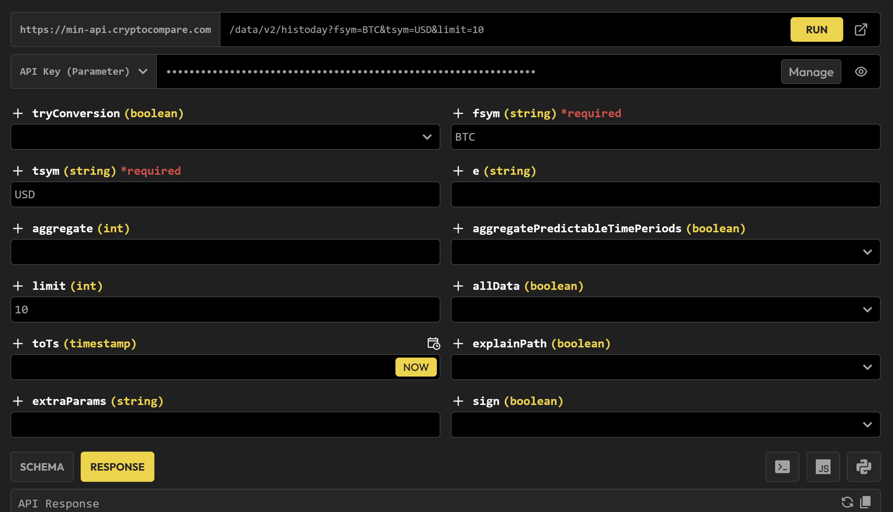
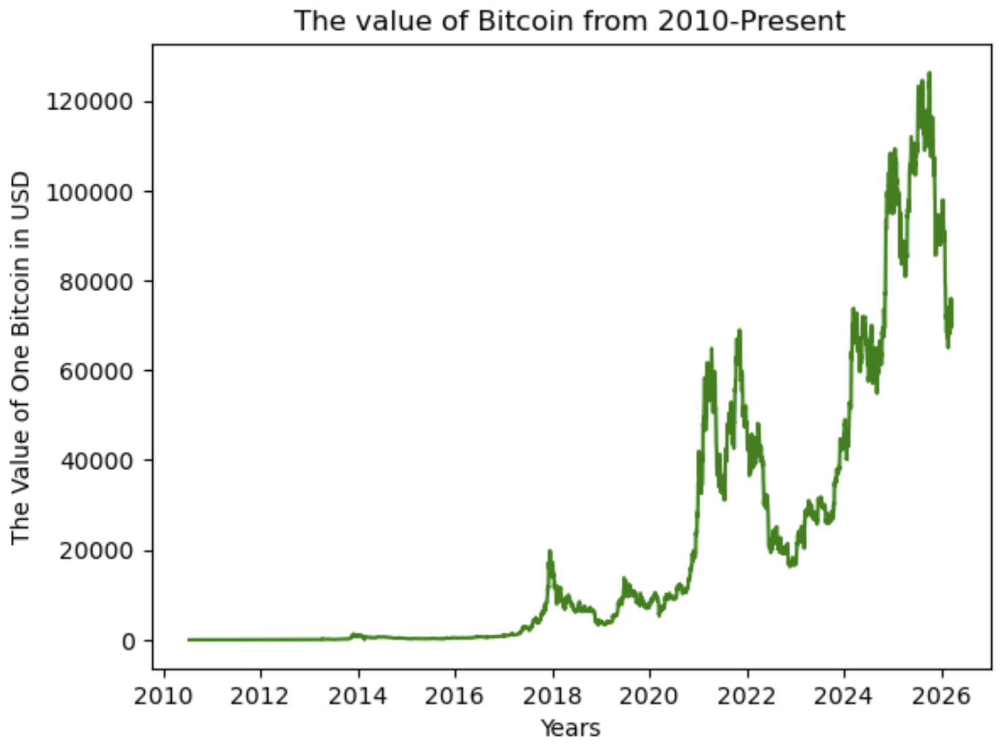

# Preface


# The actual process!

## Setting up the data

I found this website called "CoinDesk", which was a price data tracker for many cryptocurrencies, such as Bitcoin! This website actually has an "API call preview" *with parameters* on the documentation, so it was much easier to implement the output in my program!


*What the API call preview looks like!*

Here's what I basically did:

``` Python
url = "https://min-api.cryptocompare.com/data/v2/histoday?fsym=BTC&tsym=USD&aggregate=1&limit=1&allData=true&api_key=*******************************"

page = requests.get(url)
data = page.json()['Data']['Data']
df = pd.DataFrame(data)

df["time"] = [datetime.datetime.fromtimestamp(time) for time in df["time"]]
df
```
*The API key is censored for safety.*

I took the URL and extracted the historical data of the daily value of Bitcoin from the JSON! The time was in UNIX Epoch, so I had to convert it into more human-readable time.

The parameters (from the URL):
- fsym: the cryptocurrency you are interested in
- tsym: the currency you want to convert the crptocurrency into
- aggregate: the number of days you want to aggregate the data into one data point
- limit: the number of data points you want to return
- allData: Returns all data

So far, this isn't too bad. I basically called the data from an API and converted it into a pandas DataFrame!

Making a quick data visualization:
``` Py
fig, ax = plt.subplots()
ax.plot(df["time"], df["high"], color = "green")

plt.xlabel("Years")
plt.ylabel("The Value of One Bitcoin in USD")
plt.title("The value of Bitcoin from 2010-Present")
```



## Figuring out what model to use (the hard part)

Since we are trying to predict