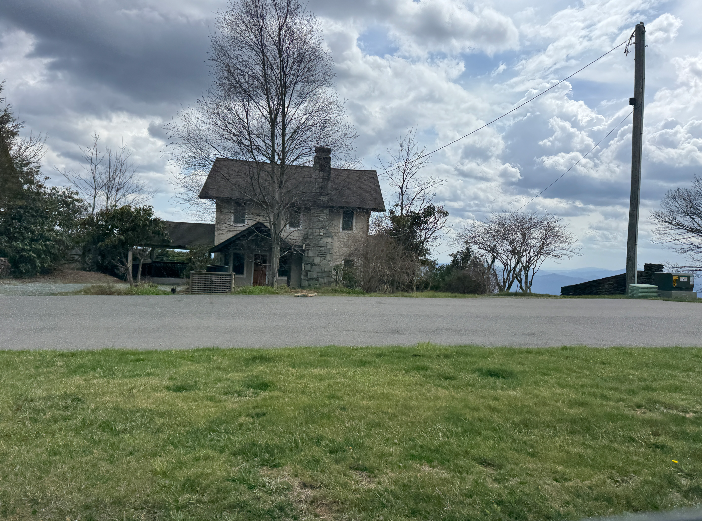
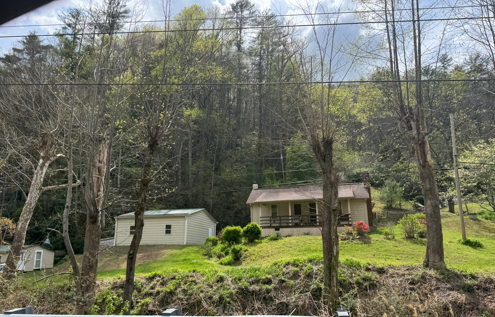
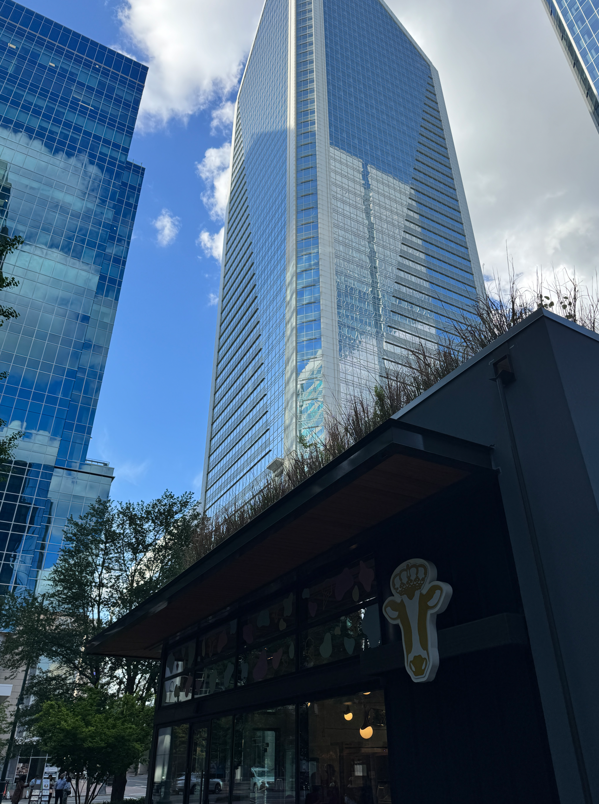
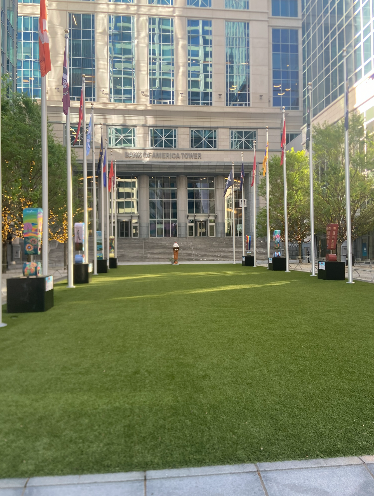
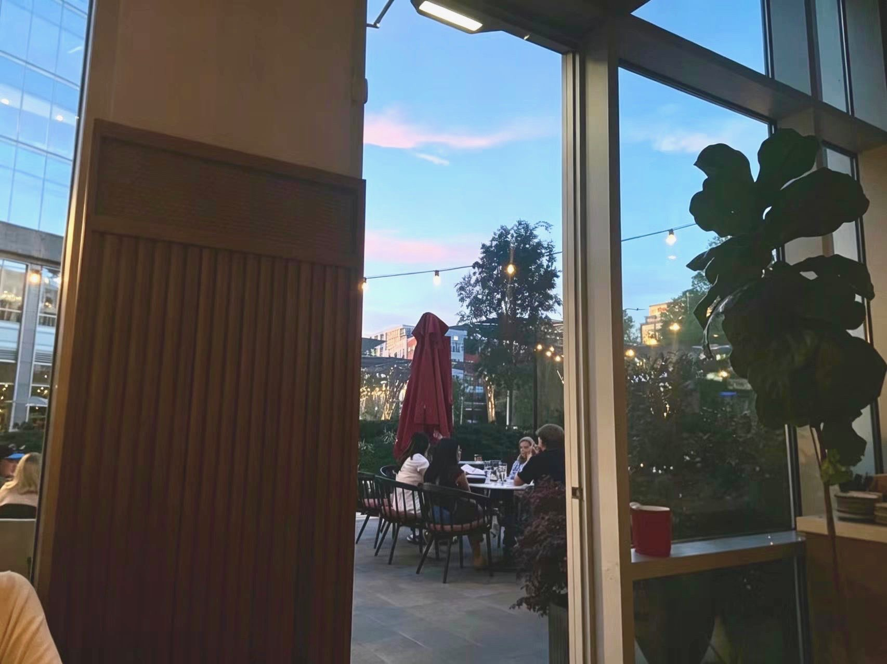
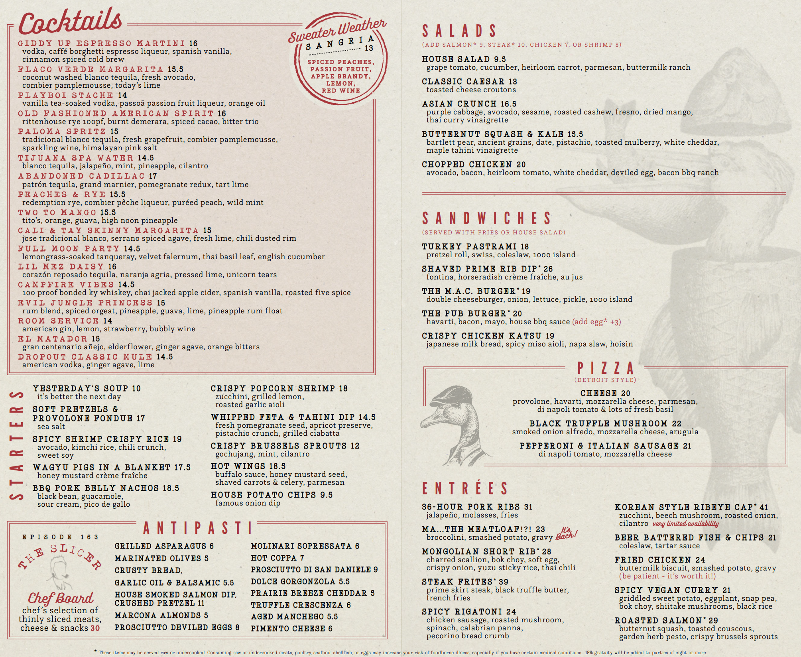

# Pre-Charlotte Funsies!

My family came down to my apartment at my university to travel to Charlotte! We decided it would be best to come during the weekend after my sister's spring break so they can come on Friday, sleep at my place, then commute to Charlotte in the morning.

*Planned trip trajectory*

My mother and I actually received an Instacart order (an app where you pick up and deliver groceries for tips) at around 9PM on Friday, being offered an 18 dollar tip! That did mean that we had to immediately get out from the comforts of my apartment to driving out to a grocery store within a 3 minute span. Unfortunately, we did not realize that delivery included *three* full packs of water bottles, and the delivery destination involved a flight of stairs and a decent amount of walking around the apartment complex. Hey, at least it paid for the electricity for the trip!

We planned to make a stop first at Banner Elk, as it has a scenic alpine coaster that seemed pretty fun to try out.

I tried taking some "good" photos (I am *very* inexperienced) while commuting:

*Going to Charlotte!*

*Some advertisements*

*Capturing some cows on the pasture, you can actually see a bit of a relfection on the window!*

## Banner Elk

We made a relatively quick stop at Wilderness Run Alpine Coaster in Banner Elk. If you didn't know, an alpine coaster is similar to a roller coaster, but is a 1-2 coaster where you can control the speed yourself!

*Picture of the building*

It's actually not possible to order your tickets online in advance, you can only make a reservation for the time you want to ride. This was a bit unusual, as you were able to buy tickets online for almost every other tourist attraction. It was a little annoying, but it wasn't too big of a deal.

The pricing was as follows:

| Section | Price |
| ------- | ----- |
| Adult Tickets (13+) | $18 | 
| Adult Ticket Bundle | $40 | 
| Youth Tickets (7-12) | $14 | 
| Youth Ticket Bundle | $32 | 
| Child Tickets  (3-6) | $7 | 
| Child Ticket Bundle | $15 | 

*The ticket bundle was a bundle of 3 consecutive rides*

We bought the tickets inside the souvenir shop. It was a little cozy "cottage" feel with many interesting things to buy. My mother chose the single ride, while my sister and I both opted for the ticket bundle, as my sister and I belived that the math for the three rides would be well worth it.

*What the souvenir shop looks like*

*A mushroom stool!*

We all got in line together, although the line was around 25 people, it took over 45 minutes for us to get onto the coaster, as several people bought the ticket bundle, so they could stay on the coaster after they complete a trip. The line moved slowly, but we didn't mind. We chatted with some of the people in line, and one of them worked closely with my high school orchestra teacher, quite the small world we live in.

*The Rules!*

We eventually got onto the coaster, the first part was slowly ascending up a hill, this is the only part where you are unable to control the coaster. Then after a quick turn on top of the hill, the controls were all yours. I *heavily* underestimated the speed of the coaster &mdash; I thought it would be a good idea to go full speed! I quickly got terrified of the sheer speed of the coaster. It almost felt like I was going to fall off the coaster tracks; I couldn't help but to slow down my coaster as I didn't want to lose any more years of my lifespan.

*what the coaster looked like*

We continued our journey to Charlotte!

# Charlotte Time!

## Arriving to Charlotte

*Love can be found in the strangest of places. Taken in the hotel parking lot*

We checked into a relatively standard hotel, nothing too special. We took a break in the hotel for an hour then went out to explore the city.

*What the hotel room looked like*

*How spooky! The hotel hallway*

*Driving towards the city!*

## City walk

The last time I'd been in a city of this size was nearly two years ago, when I visited my extended family in Guangzhou. I had basically forgotten what being in a city was like. Blacksburg was also the furthest from a city, it was deep in the mountains. It was surreal.

As we were about to cross a bridge, I had spotted the "Bank of America Tower", a rather boring name as there are twelve skyscrapers that have the *exact* same name.

*What the front lawn of the tower looked like*

Despite the lackadaisical name, it was a pleasant place to look at. The exclamation marks were part of the Charlotte SHOUT! organization, where they have an annual festival about art, music, food, and ideas! Several university flags were on display when we visited. There was a Virginia Tech flag in the back left corner, but unfortunately the wind wasn't strong enough to lift it. The flag never got its moment.

*A stamping station, unfortunately there were no papers to stamp it on*

The exclamation marks were remarkably well-done. My favorite one by far was the math exclamation mark. It incorporated things such as the L2 distance formula, geometry, and even star systems!

*Math!*

Unfortunately this one was noticeably AI generated, if you take a closer look at it, you can feel the generic AI filter along with some of the text being warped. It extremely disappointing as all of the other exclamation marks were original work. 

This one was also well made. (insert why its good)
I was actually feeling the exclamation mark to see if it was actually painted on or an image of the painting was slapped on, and it was painted on directly!

*My sister and I meticulously critiquing the art (not really)*

A rather silly figure! It's defintely a well-fit contrast compared to the "professionalness" of the buildings surrounding it.

*Ice cream*

## Food time!

I looked on Google Maps for the restaurant, and I found one called "Culinary Dropout". I thought it was a pretty fun name, so we went there. 

The restaurant exterior was refreshingly unpretentious, there was only a little sign paired with some string lights wrapped around the restaurant. It offered a warm invitation to come inside, not something you see often with resturants.

*A big building on top of the restaurant; I think it belongs to a insurance company*

When we went inside, the hostess told us that there would be a thirty minute wait, but she pointed us towards some activities right outside of the restaurant! There was ping pong, cornhole and even a jumbo-sized Jenga tower to play with! I opted to play ping ping as it was the most enjoyable.

*Playing ping ping with my sister*

Before I knew it, I received a text indicating that we were ready to be seated. Our server took us to a nice spot inside where there is a nice breeze right outside the door!

*A wonderful view outside*

The cozy lighting stayed consistent inside the resturant. There were also some performers singing live versions of popular pop covers.

*What it looked like on the inside*

*Menu*

The starters menu was nothing too special, but charging nearly ten dollars for potato chips is pricey. We were debating over if we should order the *Spicy Shrimp Crispy Rice* or the *BBQ Pork Belly Nachos*, but we ultimately decided on the nachos as my sister is squeamish on eating spicy food.

*BBQ Pork Belly Nachos, the starter!*

It tasted really good! It taste like what nachos would usually taste like but the ingredients' quality is much higher. I noticed that the nachos itself came freshly off the deep fryer, the guacamole had a nice kick from the lime juice, but I didn't taste too much barbecue flavor from the pork belly.

*my main course*

*my sisters main course*

*my mothers main course*

*dessert*

*dessert part 2*

## More city walks!

*night*

*even more night*

*tower at night*

*cool image thing on the left*

## Museum of Illusions

*spiral*

*heart illision*

*towers of hanoi*

*hii robot!*

# The next day

*Good morning!*

*Only in America where it's socially acceptable to have an ungodly amoutn of sugar for breakfast*

# NoDa

# --

# pilot mountain

# back home

