# Background

## Rules/Objective

Minesweeper is a video game where it features a grid of tiles you can click on, some of which have hidden mines. The objective is to click on all of the non-mine tiles. The revealed tiles will have a number that represents the corresponding number of mines adjacent to that tile. To lose the game, it's relatively simple; click on a tile with a hidden mine!

Let's do a quick example if you do not know the rules already:

We are given a 4x4 grid with four mines.

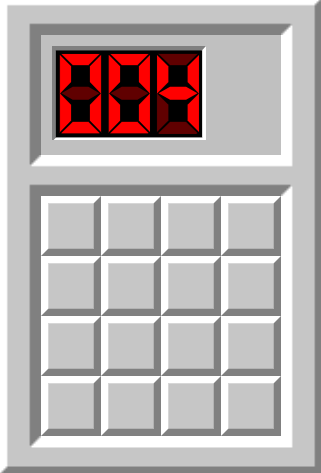

First tile click:

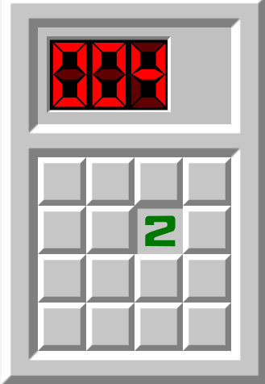

There is the number "2", meaning that there are two mines in the adajcent squares (including the corners) of the revealed tiles.

Another tile click:

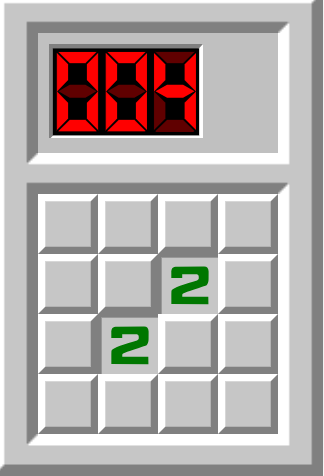

There is also a number "2" here, there could be a few scenarios here:
1. There are two mines intersecting the revealed tiles (The flags are meant to be markers for the tiles that have a mine)
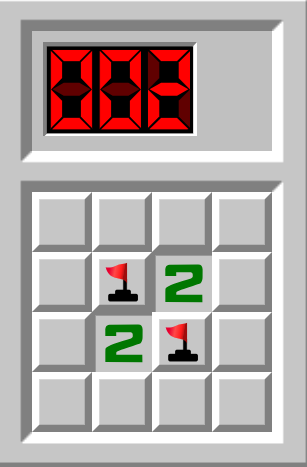

2. There are three mines in a diagonal format
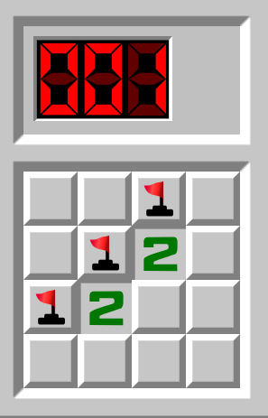

3. There are four mines on the opposite side of the revealed tiles
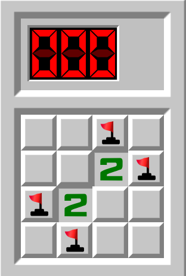

There are much more possiblites, but I wanted to highlight a few.

Clicking on the third tile:

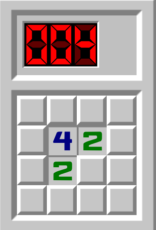

This actually reveals alot of information. Since we know that the are four mines in total, the number four in the revealed tiles means that all possible mines are within the adjacent squares of that tile! So effectively, we can simply ignore the right-most and the bottom-most row/column.

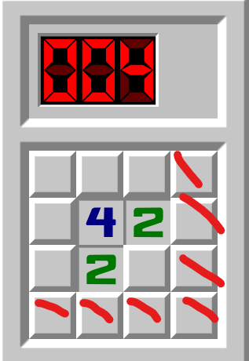

This is nice because we can click on those tiles freely to gather further information.

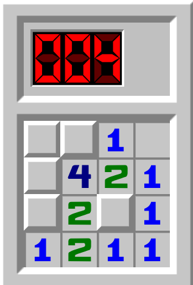

Okay! This is relatively straightforward now.

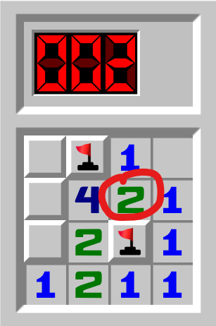

We *know* that there are two mines here b/c there are two mines in the tile cirlced, and since there are two tiles left, they must be there!

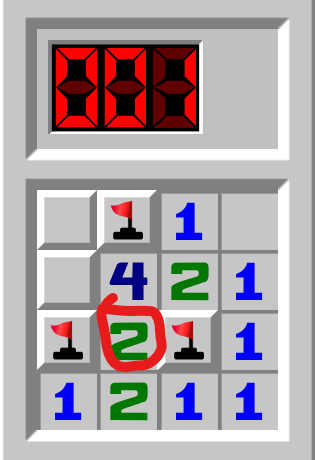

There is also another mine near the bottom left corner, as the number one below indicates as so. Notice how that there are two mines in the adajcent tiles marked already for number circled. If we know for *sure* that there are two mines in those locations, we can simply click on the unmarked tile that is adajcent to the circled number.

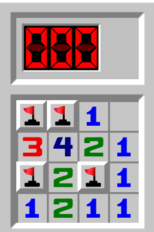

Yay!! That's how you win in Minesweeper.

## Setting the Scope

I will be exclusively doing attempts on a website called minesweeper.online. It is by far the most popular website where players can be competitive in categories such as win streak, efficiency, time, etc.

In this case, I will be doing the "Expert" board on the website, which was a 30x16 board with 99 mines, and I will attempt to beat it as quickly as possible within my 24 hours of playtime for Minesweeper.

There are actually two "ways" to play Minesweeper on that website, the standard mode and the "no guessing" mode.

The standard mode is standard Minesweeper, the mines positions are predetermined before a game begins and does not change locations.

The "no guessing" mode, or NG, is a little bit different. In standard Minesweeper, there is a possiblity of a "50/50" guess.

Take this for example:

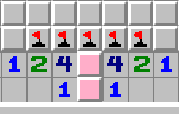

*Source: https://minesweepergame.com/strategy/guessing.php*

The pink tiles highlighted indicate that there is one mine in either of the two tiles, but there is no way to find out *which* pink tile it's in without guessing, making it a "50/50" guess.

Under the hood, NG Minesweeper has invisible solvers where it moves mines around automatically to mitigate the 50/50 guesses. It does take out the aspect of guessing in minesweeper, which is actually much more advanced and deep than what you might expect guessing to be. 

I was already faced with this dilemma of either picking standard or NG to measure my final results on. I opted to measure my final results using the standard mode as most Minesweeper players play that mode, as the element of guessing is vital to the game.

# Beginnings

