***Some of the photos taken are not mine, as this is an event that occured before I began to blog.***

# The events before the tournament

I was coming back to Richmond to visit my mother for Valentine's weekend since it was her birthday, but I had gotten screwed over the day prior as I was supposed to get carpooled by someone then they ghosted me after I asked for a confirmation. Feeling frustrated, I had to scramble out of my bed to buy an early-morning Amtrak ticket.

The train was scheduled to depart at 9:55 AM in Roanoke, so it wasn't too fun considering that I had to wake up at around 6:30 AM to commute all the way to Roanoke by *only* using public transportation from Blacksburg.

I left my apartment at around seven to catch my first bus, which took me from my aparment to Virginia Tech's main transfer bays, which was a 10 minute commute. I was still feeling incredibly sleepy as I usually never wake up this early (my classes usaully start past 11AM). I then boarded the second bus, which was called the "Smart Way Bus", a rather unremarkable name.

*A view of the bus, notice the \"Smart Way Bus\" decal on the side.* 

The bus left promptly at 7:45AM; it was a 90 minute trip to get to the train station in Roanoke. The early morning sun had a distinct "warm-orangey" feel, it felt like a "filter" applied to everything it touched.

At around 9:15AM, I had arrived at the Third Street Station. The walking commute from the Station to the Amtrak platform was seven minutes, unlike where most stations are housed adajent to the train. I sat down in the waiting room of the station for around ten minutes, it was a little chilly outside and my train doesn't come for another 40 minutes.

Not the smartest idea I've had, but not the worst.

I decided to walk alone from the station to the platform, but during the walk I was a bit on the edge as the place looked a little rougher than I hoped, turning my back every 20 seconds. Thankfully nothing happened and I was likely overreacting. I felt much more comfortable when I got onto the platform and saw many people waiting for the train to arrive.

The train arrived *very* slowly. I could have outwalked the train! I boarded the train and plopped myself into a seat. The seats on the Amtrak are very spacious, giving me plenty of leg room. It felt like a reward of some sort as the events prior certainly did not go my way.

The train ride was 2 and a half hours long, passing through Lynchburg and getting off at Charlottesville, giving me plenty of time to kill.

I went onto my laptop and played *Hollow Knight: Silksong*. I had recently beaten the most difficult challenge in the first game, "Pantheon of the Hallownest". Often referred in the community as "p5", it's the fifth and final challenge of the gauntlet of bosses you had to fight consecutively, combining the first four Panthenons into one single Pantheon to make a grand total of 42 unique bosses to fight.

At around 12:30PM, I had arrived at my destination in Charlottesville. My mother actually drove an hour from Richmond to come and pick me up. Love you mom!

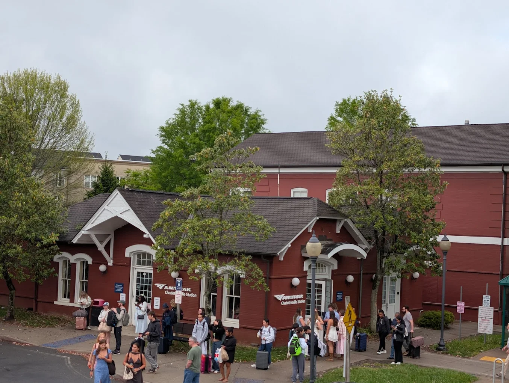
*An aerial view of the Charlottesville train station. Credit: Sylvia Lin*

Later in the day, we both went to Trader Joe's to pick out some flowers for my mother. Unsurprisingly, the store was *packed* near the flower section as it was Valentine's weekend. I picked out some warm colored roses with a cooler colored under-side(?) along with some filler (the small white buds you see in the image). And yes of course, I paid for it :3
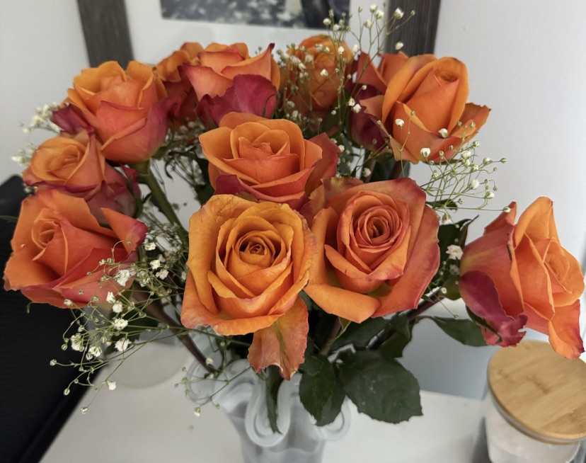
*The flowers I bought neatly placed in a vase*

# The tournament

The tournament was scheduled to start at 10:15AM the following day at the Black Iris Social Club in downtown Richmond. The venue interior was interesting, it featured what looked like a art gallery when you first enter, but there's a whole bar connected if you go through the back door! The weather felt almost perfect, it was a light drizzle when I made to the venue at around ten.

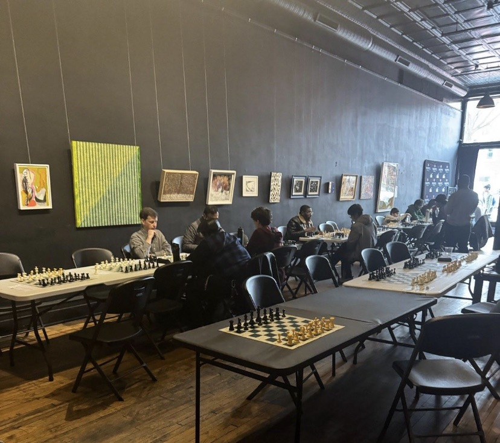
*The venue shown, during the latter moments of the second round. The tables on the left were the open section, and the tables on the right were the U1300 section.*

The schedule went as followed:
| Round | Time started |
| ----- | ------------ |
| 1     | 10:15AM      |
| 2     | 11:15AM      |
| 3     | 1:00PM*      |
| 4     | 2:00PM       |
| 5     | 3:00PM       |

**accounts for lunch break*

There were two sections, the open section and the Under 1300 Chess.com / 1400 Lichess / 1000 USCF. Chess.com and Lichess are both chess websites with online rating. USCF however, is more offical where you can only gain or lose rating points in "USCF-rated" games, meaning that those games can only be played in in-person tournaments. This tournament is *not* USCF-rated.

I played in the open section because I was well above the 1300 Chess.com threshold, meaning that I will encounter much more difficult opponents. There were actually some prize money on the line!

| Place | Open Section | U1300 Chess.com Section |
| ----- | ------------ | ----------------------- |
| 1st   | $100         | $65                     |
| 2nd   | $50          | $40                     |
| 3rd   | $25          | $20                     |

Each game was 15+10, meaning that you start with 15 minutes and your time gets added by 10 seconds every time you make ae mode. Most people, including me, recorded their moves. However, in the latter stages in the game, there is not enough time to record moves and to play off increment. This is why most of the games I will have below do not have a clear-cut ending.

Going into this, I was a little nervous, probably because this is a new experience for me and I always get nervous whenever I am experiencing something new. After a round or two, I eased in comfortably. 
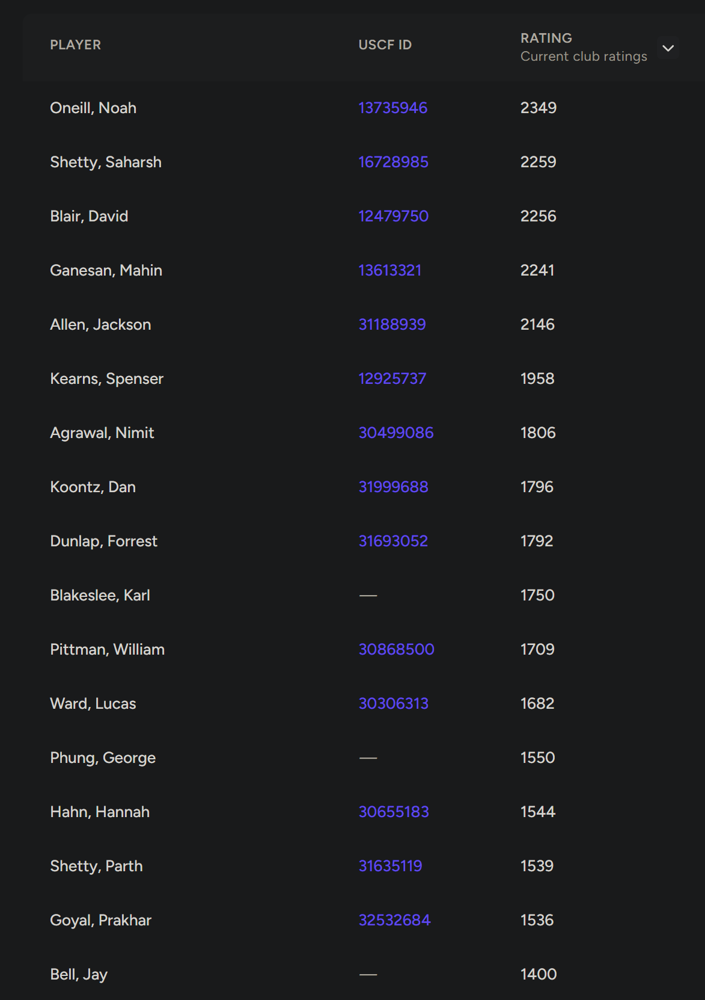
*The list of players registered and their respective ratings*

My only expectation going into this was to score at least one win as this was an extremely high rated tournament. The average rating was around 1780, more than two hundred points higher than what I currently have on Chess.com.

**Quick lesson on chess notation:**

Chess uses a coordinate system to describe moves. The board is an 8x8 grid 
where columns are labeled **a-h** (left to right) and rows are labeled **1-8** 
(bottom to top from White's side).

Each piece has a letter:
- **K** = King
- **Q** = Queen
- **R** = Rook
- **B** = Bishop
- **N** = Knight (K was taken!)
- Pawns have no letter

A move is written as the piece letter followed by the destination square. 
So **Nf3** means "Knight to f3" and **Bb5** means "Bishop to b5". 
Pawns are just the square alone, so **e4** means "pawn to e4".

Some special symbols:
- **x** = capture (Nxf3 = Knight captures on f3)
- **+** = check
- **#** = checkmate
- **O-O** = kingside castle
- **O-O-O** = queenside castle

One more thing, I will be using the term touch-move, meaning that if you touch a certain piece, you *must* move that said piece.

## Round 1
*I would have provided the pictures my mother have took during my games but I have not asked for my opponents consent, so unforunately there will be not many photos here*

I was paired against Mahin Ganesan (2241) in the first round with the white pieces. He actually went to UVA and graduated a few years ago.

The game started off with:

1. e4 e5 2. Nf3 Nc6 3. Bb5 a6 4. Ba4 Nf6 5. O-O Be7 6. Re1 b5 7. Bb3 d6

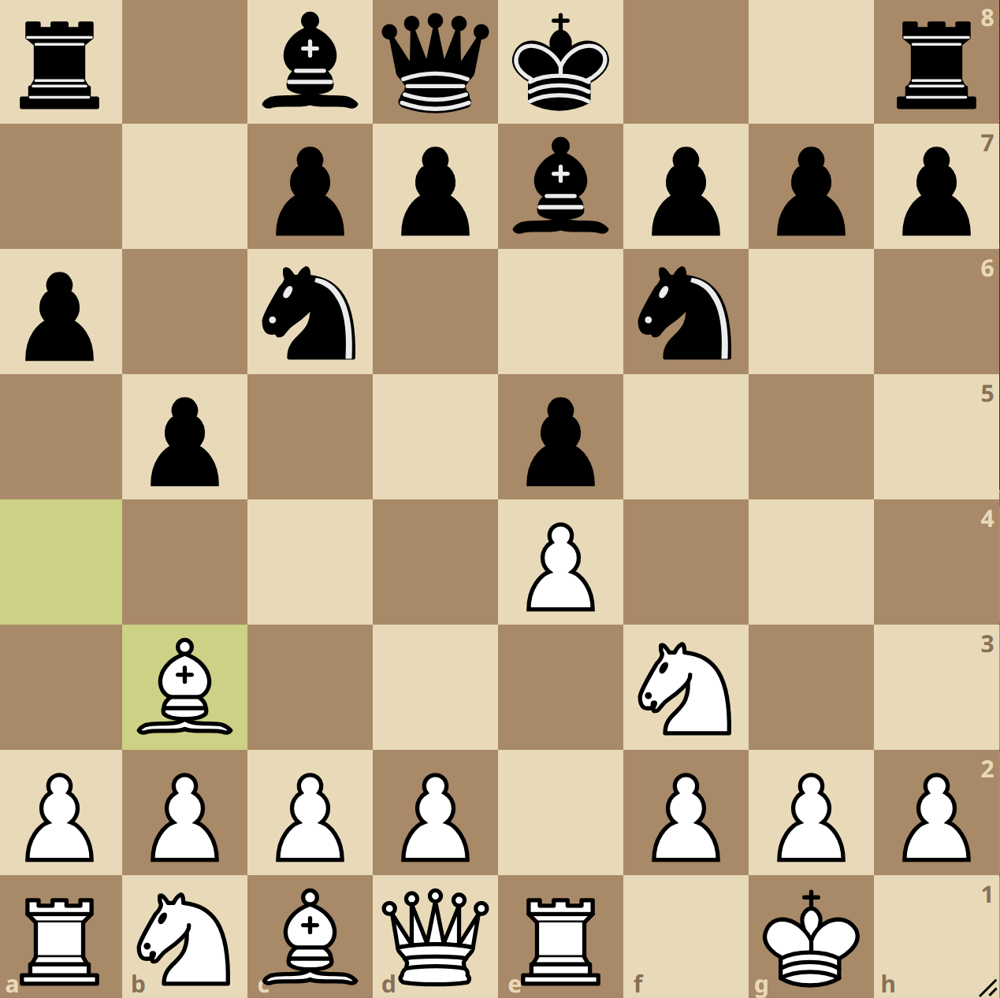

During the game, my opponent mixed up his lines as he wanted to play d5 to play the Marshall Gambit but hasn't castled yet. Since he touched his d-pawn already, he had to move it (touch-move rule), this is still a real line to play as black, but rather it being more tactical, it's now more of a slow, manuvering game.
The main line Marshall Gambit follows: 7. ... O-O 8. c3 d5 9. exd5 Nxd5 10. Nxe5 Nxe5 11. Rxe5 c6 12. d4 Bd6 13. Re1 Qh4 

8. c3 Na5 9. h3 Nxb3 10. axb3 c5 11. d3 O-O 12. Nbd2 Qc7 13. Nf1 Re8 14. Ng3 a5 15. Kh1

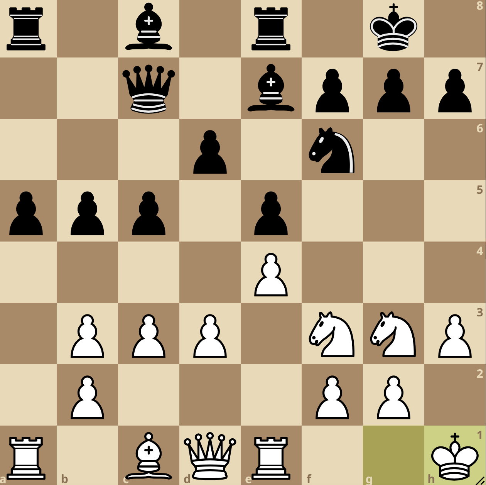

During the game, I evaluated the position was me being able to do nothing--by moving my king back and forth-- but it's incorrect. If I just waited and did nothing, my opponent will eventually roll me down on the queen-side, hence why I should have played Nh4 to eventually get a knight on f5, as in the traditional Spanish lines the square I want is f5 and eventually get a king-side counterattack.

15. ... Bd7 16. Qc2 Ra7 17. Be3 Rb8 18. Kg1 Raa8

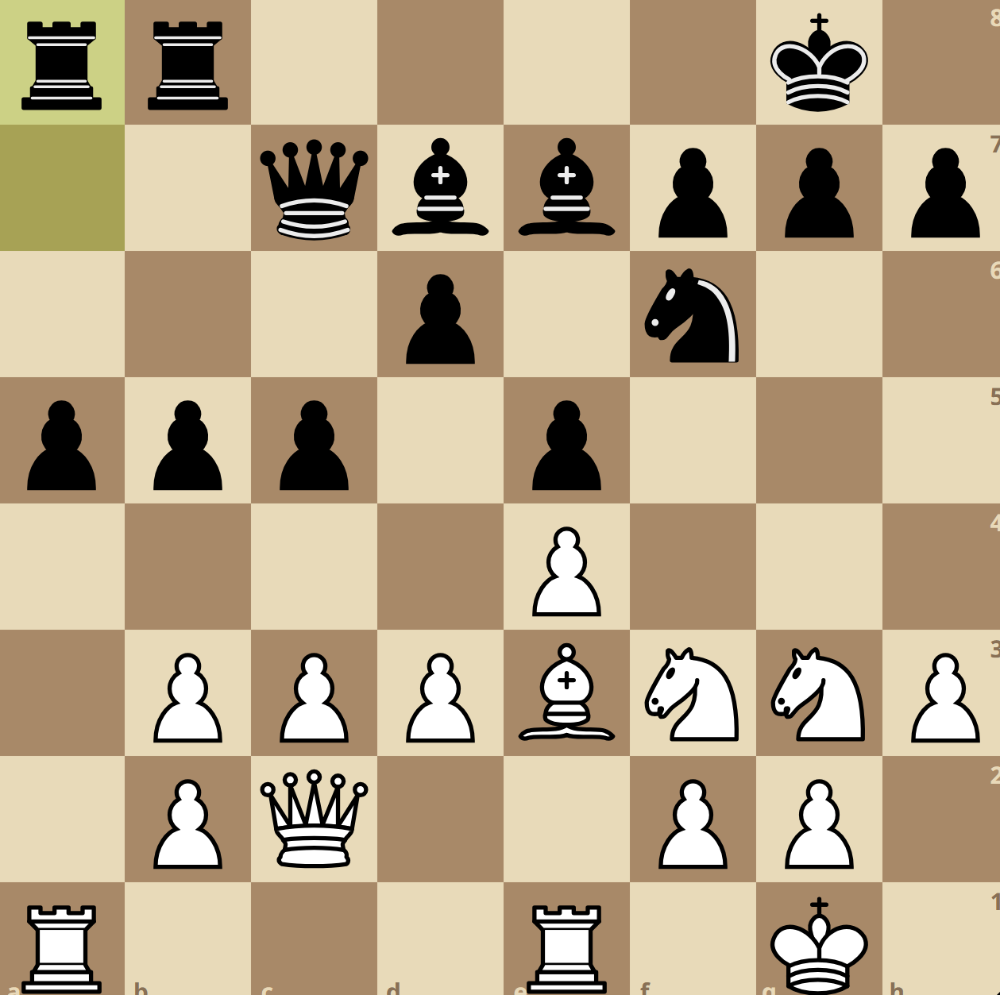

A few moves ago, my apponent moved his rook to a7, persumably to double up the rooks on the a-file, but I think he missed the move bishop to e3, pinning the c-pawn to the rook, meaning that if the c-pawn moves, the rook would be under attack he would lose it. Looking very annoyed, he moved his rook back to a1, and I couldn't help but smile.

19. Ra2 a4 20. bxa4 bxa4 21. Rc1 Rb7 22. Nd2 d5 23. Bg5 Qc6 24. d4 

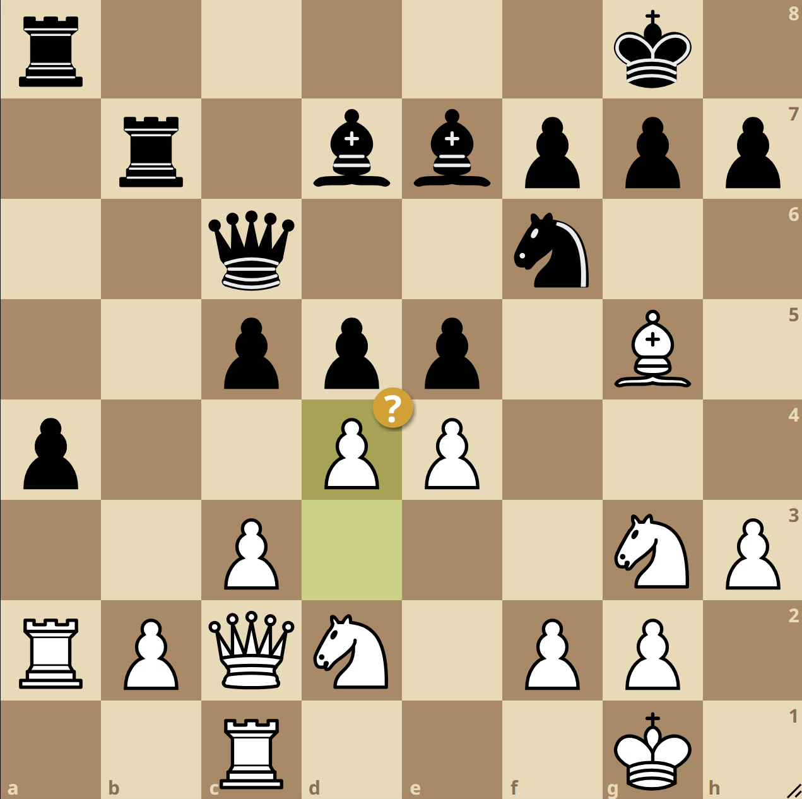

Oops, I blundered a pawn randomly...

24. ... cxd4 25. cxd4 Qe6 

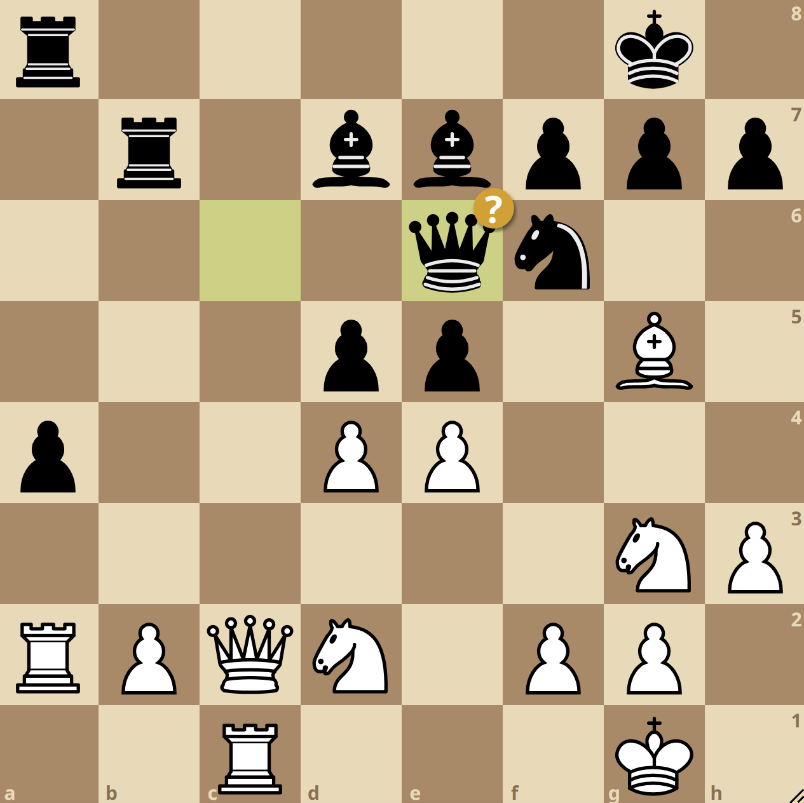

My opponent got spooked out here actually, because he thought after taking the pawn on d4 after trading the queens, he thought I had e5, but it does not work! He can counterattack my bishop on g5! After I take his knight, he does *not* take my bishop right away, instead he can play bishop to d6, effectively trapping my bishop.

26. exd5 Nxd5 27. Be3

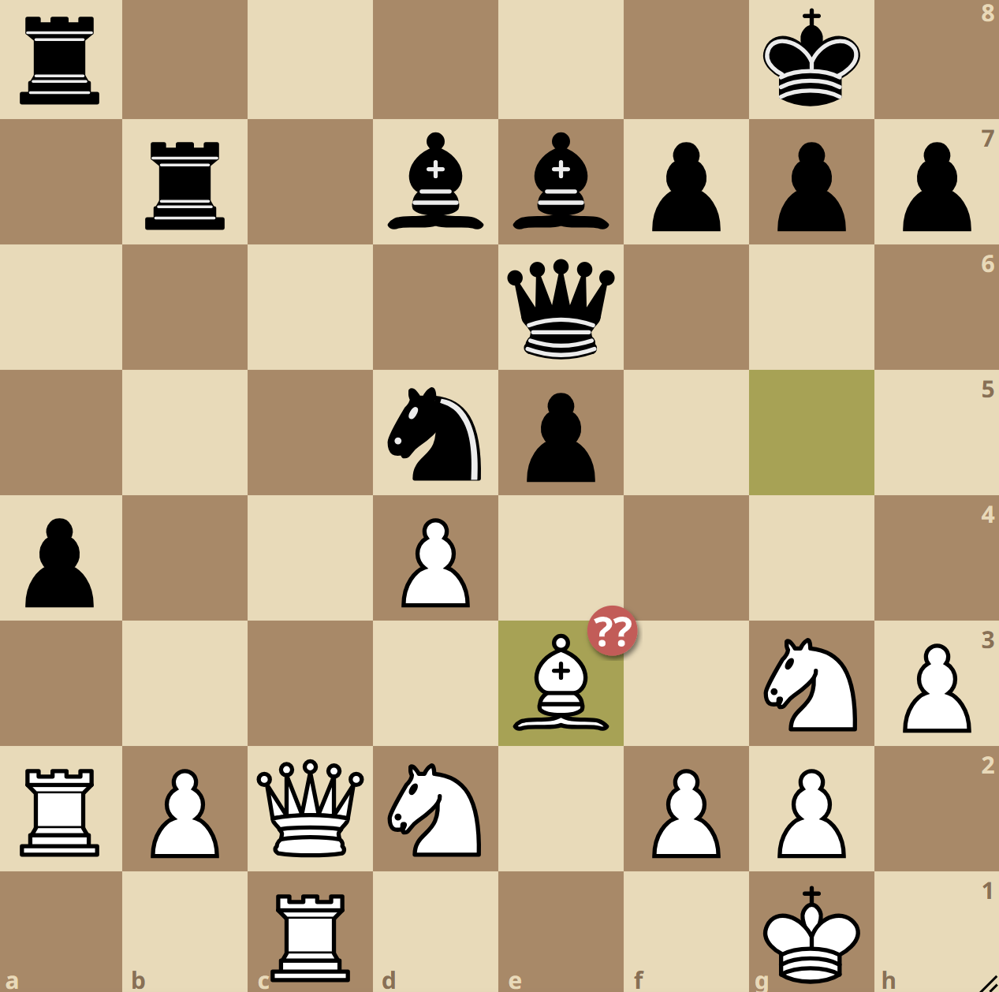

The final blunder of the game by me, the position was already difficult to play both practically and under time pressure, and my opponent plays the right move Nb4!, double attacking my rook and queen, effectively ending the game.

We both analyzed the game after, and I actually found out that his favorite opening is the Marshall Gambit, also my favorite opening! A little bummed that I had a chance in the game, but again he was almost 700 rating points higher than I was.

Results after round one:
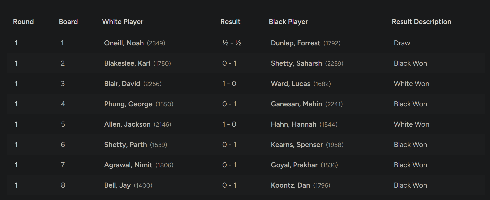

There was actually draw on the first board with a 557 point discrepancy! A wonderful game by the underdog!

## Round 2

I was paired against Jay Bell (1400) with the black pieces.

The game began as:

1. e4 e5 2. Nf3 Nc6 3. d4 exd4 4. Nxd4 Bc5 5. Nxc6 Qf6 6. Qe2 bxc6 7. Nc3 d6 8. g3 Ne7 9. Bg2 Ba6

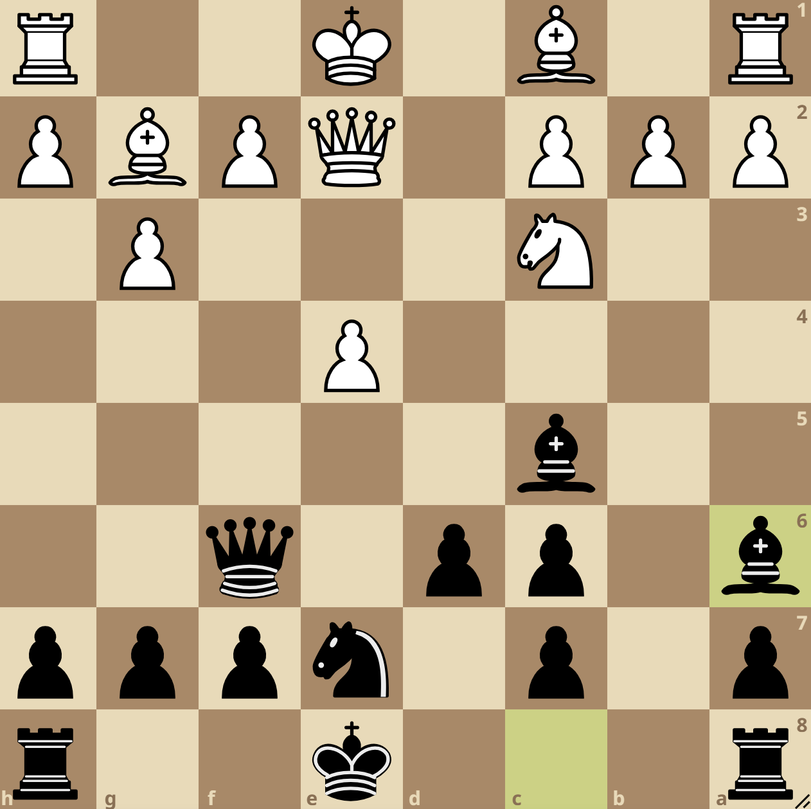

This move looks like that I'm giving away my a6 bishop for free, but if he takes it with his queen, I take his f2 pawn with my queen! It's a fork between his king and his light-squared bishop, meaning that I get my bishop back and his king becomes *significantly* weaker! My opponent did not take bait to his credit.

10. Qf3 Bd4 11. Bd2 Rb8 12. Qxf6 Bxf6 13. b3 O-O 14. Rd1 Rfe8 15. f4 Bd4 16. Ne2 Bb6 17. Bc3

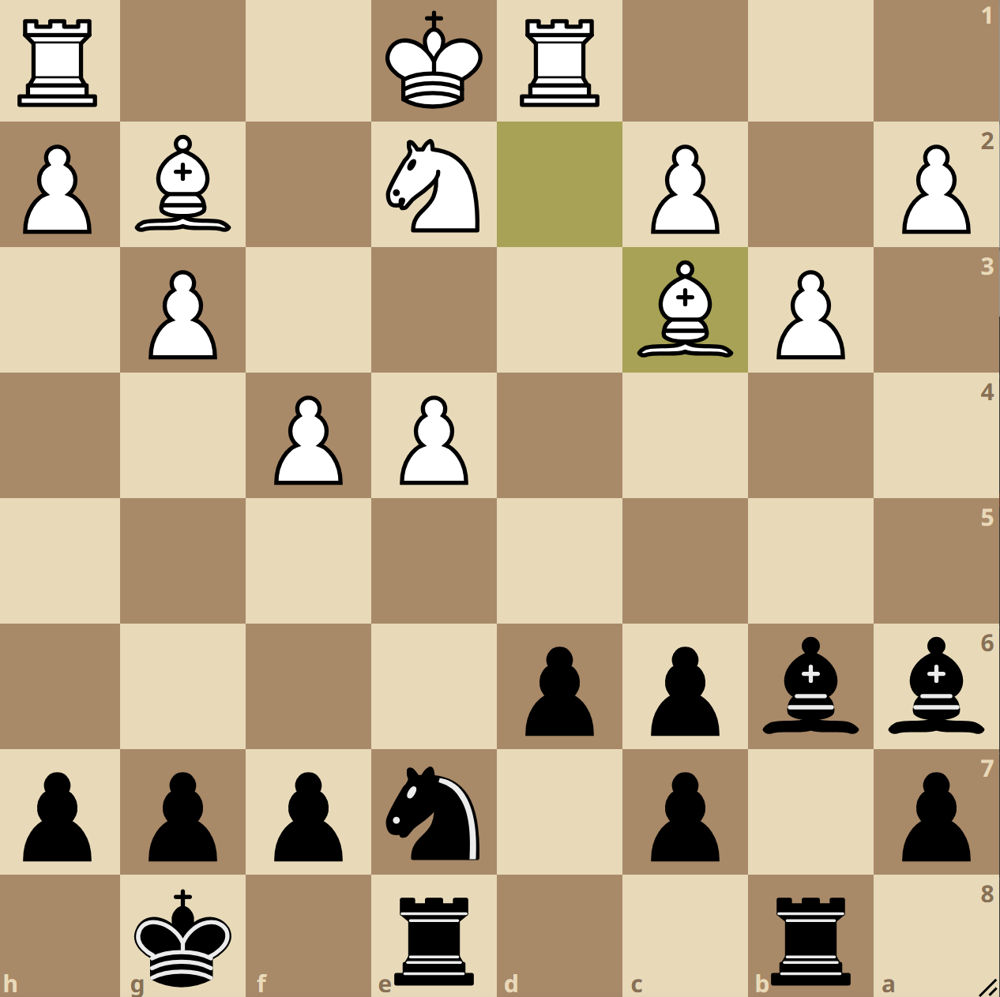

The computer engine evaluates this position was "-2.1", which basically means that this is "better" for black. The best move suggests going Nd5, threatening to go Ne3, forking the bishop and rook with both cannot be defended. If my opponent took the knight with the pawn, you lose both the knight and the bishop. If my opponent goes bishop back to d2, the line follows: 18. ... Nf6 19. Nc3 d5 20. e5 Ng4 Rc1 21. f6 - White will eventually lose the e5 pawn and will be a pawn down. 

But I took the knight with the bishop on e2, plummeting the engine evaluation down to "+0.2", meaning that white is a teeny tiny bit better.

17. ... Bxe2 18. Kxe2 d5 19. e5 Ng6 20. a3 

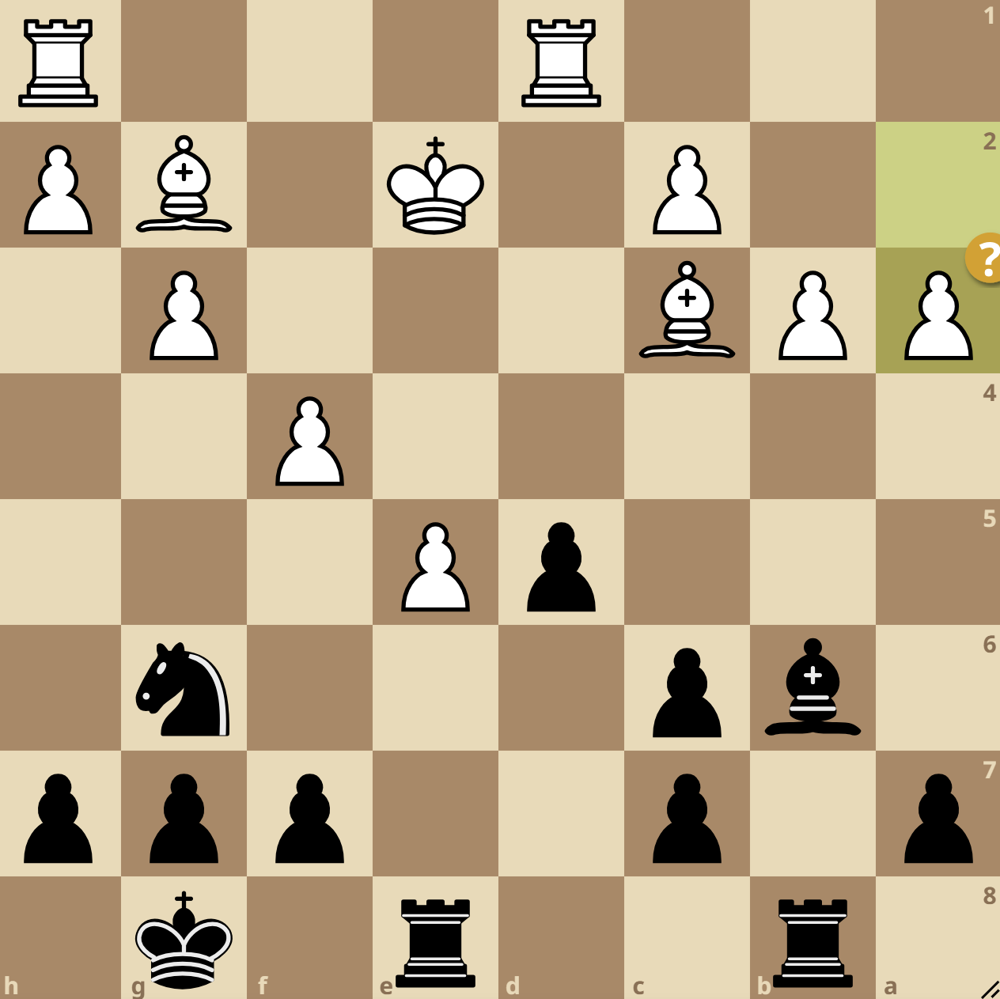

This is similar to the line I showed above, I played the move f3, effectively meaning that I am a pawn up.

20. ... f6 21. Rhe1 fxe5 22. fxe5 Nxe5 23. Kd2 Ng6 24. Kc1 Rxe1 25. Rxe1 Rf8 26. Re2 d4 27. Bb2 c5

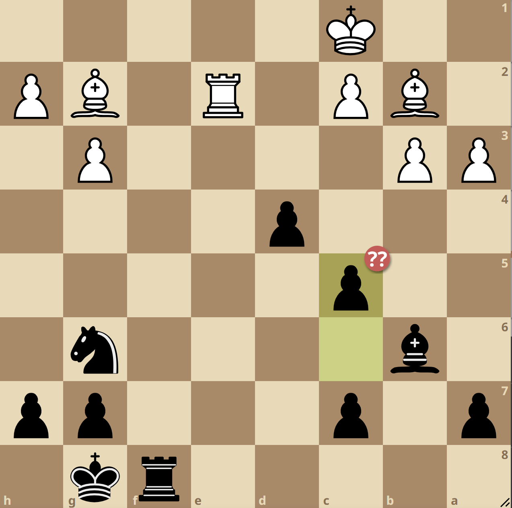

This is a really bad move by me, this effectively blocks in my dark-squared bishop without losing the pawn if my opponent played Bd5+. In the long term, my opponent will gradually bring his king to b5 and use his a-pawn to attack my trapped bishop.

But thankfully, he misses that move.

 28. Be4 Re8 29. Kd2 Ne5 30. Bd5+ Kh8 31. b4 c4

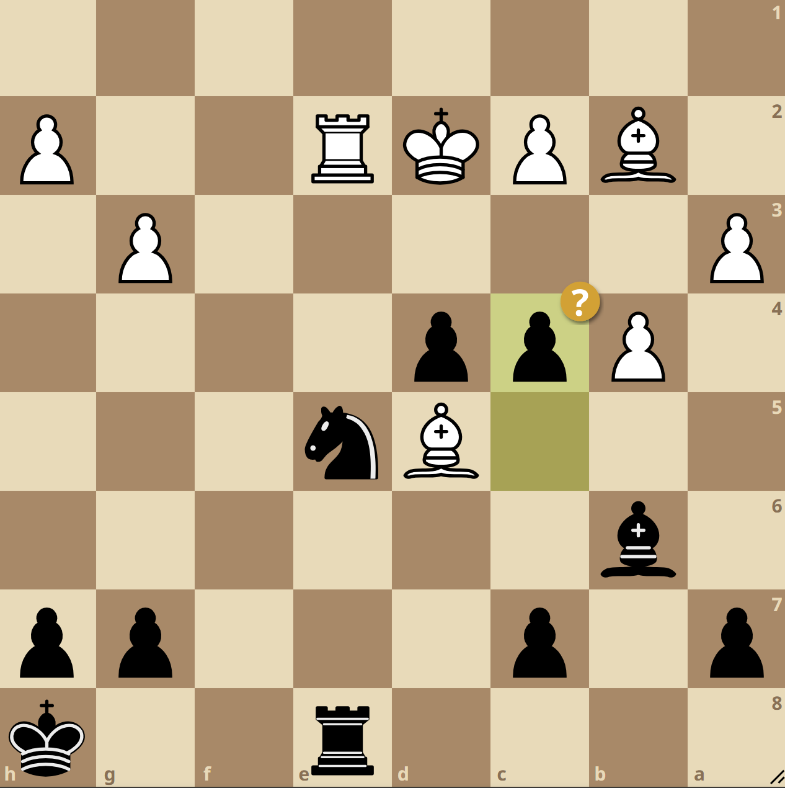

Another mistake by me, the main idea of this mistake is that my knight is not actually defending the pawn I moved up to c4, as my rook would be under fire at e8! But you cannot take the c4 pawn right away yet, as I *can* take it with the knight because it's with check. So in this position, you simply move your king to d1 and I'll either simply lose the pawn or have my rook be overloaded with pressure, eventually losing the knight in a few moves.

But my opponent plays... 32. Ba1

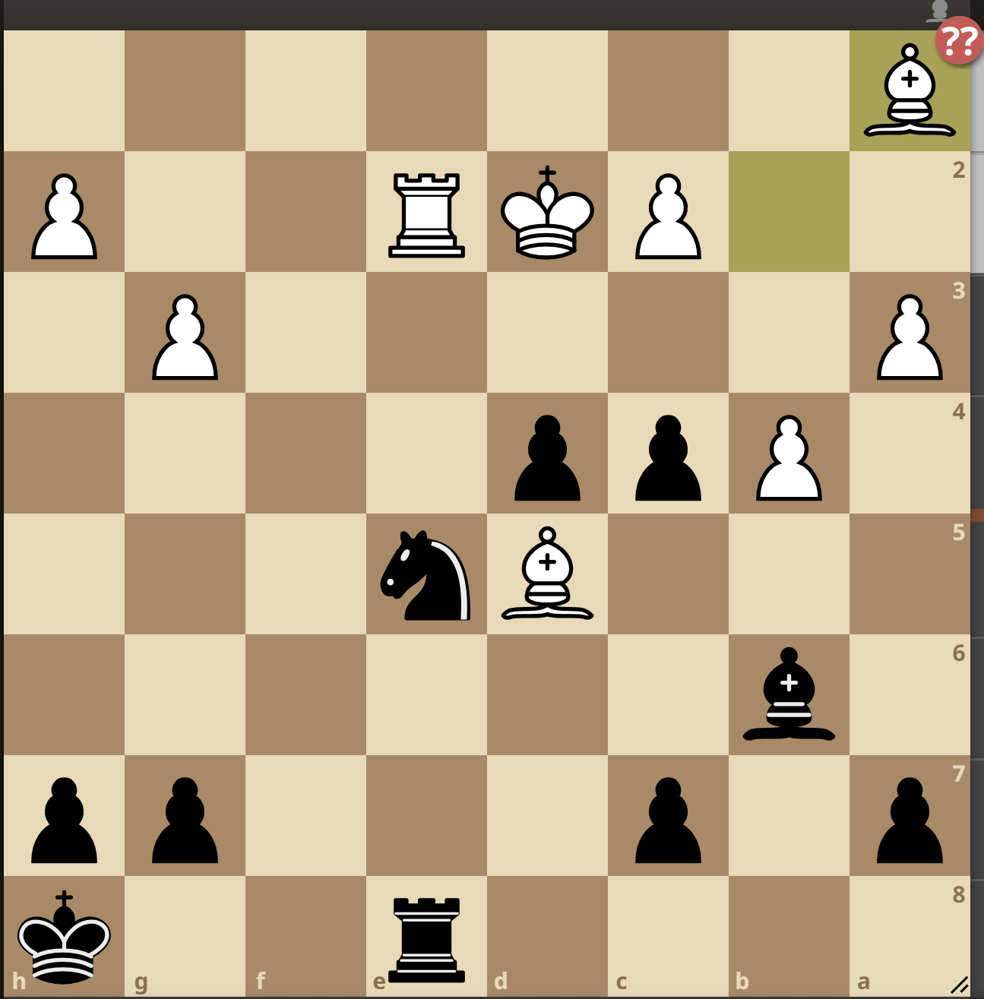

I think the most plausable explanation is that my opponent accidentally touched the bishop, as since it was touch-move, he had to move it. I think he got a little bit tilted and moved the bishop to a bad square, already accepting his defeat from that one little mistake. But his position was still fine if he moved the bishop to c1 and not to a1. I couldn't help but to feel bad for him.

The bishop being on a1 effectively locks it out for the rest of the game, as there is no way for your dark-squared bishop to escape after I play the move c3.

 32. Ba1 Re7 33. Re4 c3+ 34. Kc1 Ng6 35. Rxe7 Nxe7 36. Be4 c5 37. b5 Kg8 38. Kd1 Kf7 39. Ke2 Ke6 40. Bg2 Ke5 41. Kd3 

 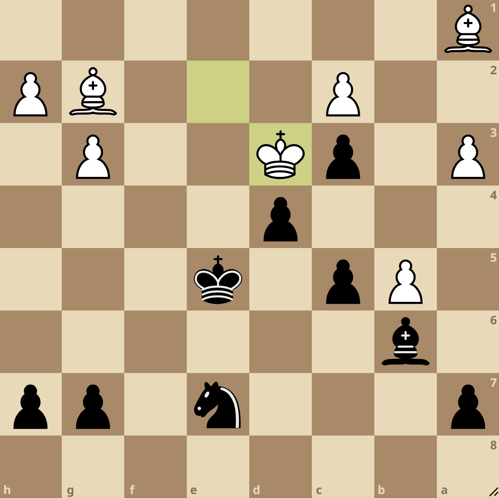

 This was the final recorded position, I won this game easily by targetting the g and h pawns with my knight and bishop.

 We didn't analyze too much after the game, which I understand because he basically lost a game to an accidential touch.

 The results of round 2:

 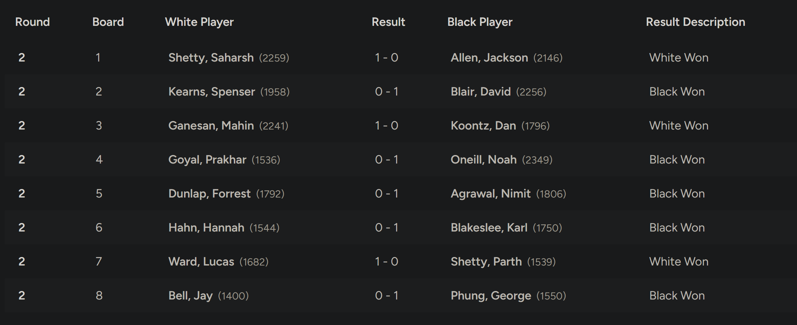

I was happy that I managed to get a win, even though it was by a technicality.

A good amount of players had already left the venue to grab lunch when my game ended. I elected to check out the food back in the bar as that piqued my curiosity. The food on the menu had more or less generic bar food; they had wings, pizza, etc. I ordered the pepperoni flatbread pizza (no image sorry) and it was good! There was actually a few chess boards set up back at the bar section, so I played a few casual bitz games with some of the members!

## Round 3

I was paired against Dan Kootz (1796) with the black pieces in the third round. He actually won the 2025-26 Virginia Scholastic & College Championships in the amateur section!

1. e4 e5 2. Nf3 Nc6 3. d4 exd4 4. Nxd4 Bc5 5. Be3 Qf6 6. c3 Nge7 7. Bc4 O-O 8. O-O d6 9. Nxc6 Nxc6 10. Bxc5 dxc5 11. Na3

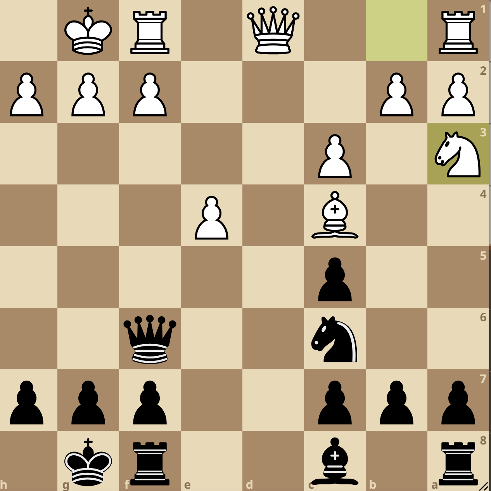

I thought knight to a3 was a weird move when he played it, usually the knights go more towards the center of the board. He was probably going for ideas such as jumping to b5 and target my c7 pawn. Hence why I played a6 on the next move.

 11. ... a6 12. f4 Be6 13. e5 Qe7 14. Bd3 Rad8 15. Qc2 h6 16. Rf3 Bd5 17. Rg3 b5 18. Qe2 
 
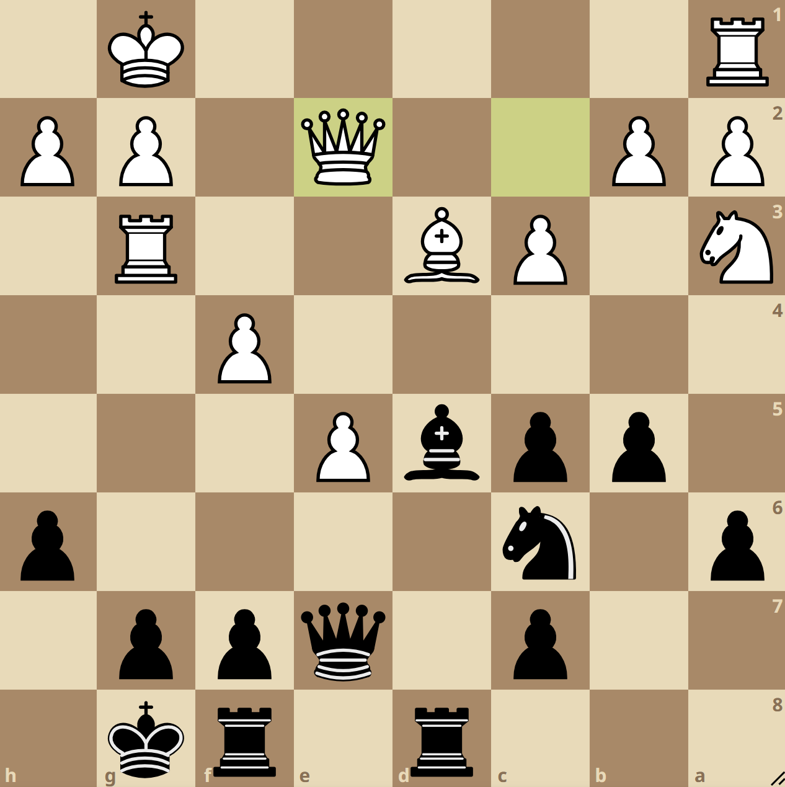 
 
 White has a pretty strong attack on my king-side, his rook is directly aimed at my king, his queen is ready to go to h5, and his bishop targets the light-squares, making defense more difficult. I had ignored the attack, going at the queen-side instead. This was the last possible moment where I could addressed white's attack without being completely losing. The move f6 opens up the center, allowing my pieces to defeend my king on time.

 Howeever, I did not play f6 and from that on, I was in a losing position.

11. ... Rfe8 19. Qh5 Qe6 20. Bf5
 
 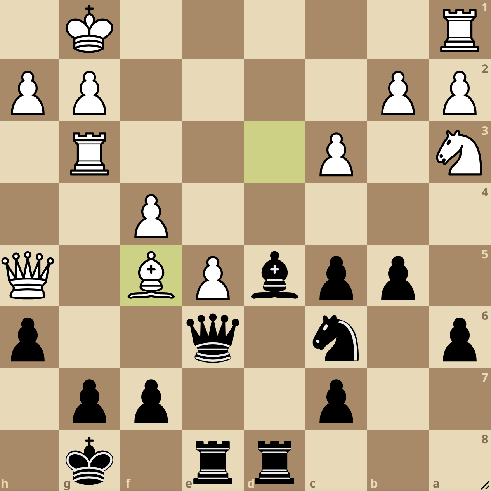
 
It became clear that I was going to lose this game when he played that move, as my queen cannot defend h6 any longer. At that point, I was really annoyed with myself, looking at the rainy weather with disgust.

 20. ... g6 21. Bxe6 Rxe6 22. Qxh6 b4 23. Rh3

 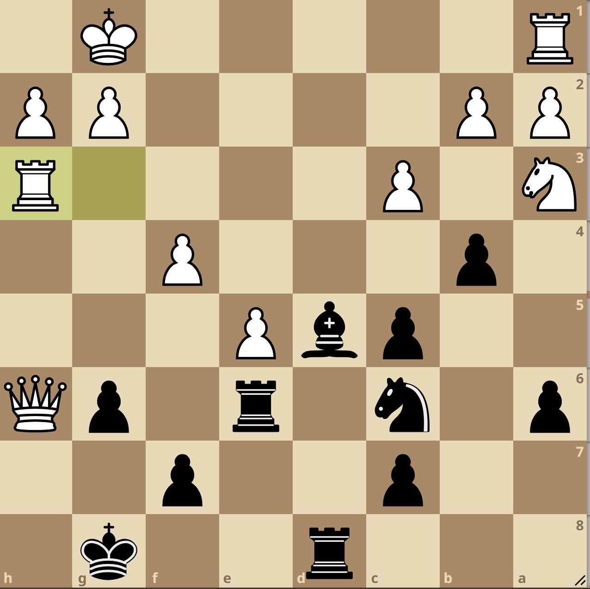

I resigned in this position, as my opponent had a checkmate in two. I was really bummed over this loss, as I lost extremely quickly and never had a chance. We both chatted after the game and explored some openings together!

The results of round 3:

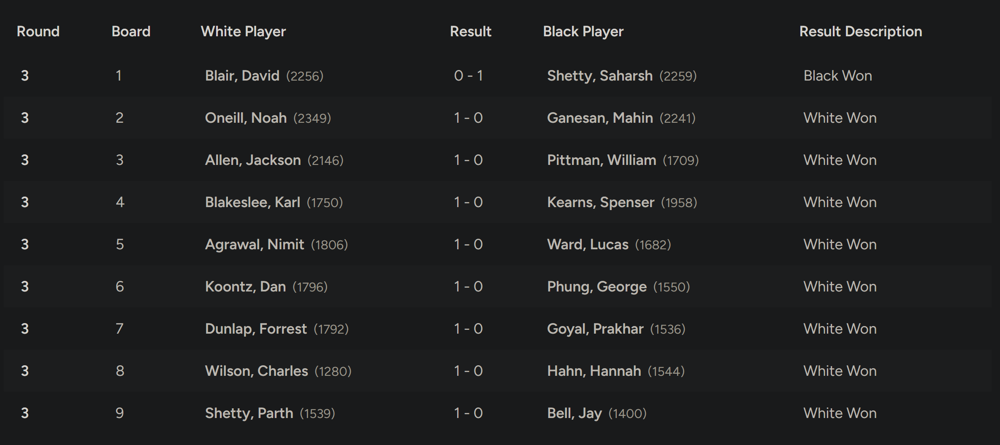

## Round 4

In the fourth round, I faced against Spenser Kearns (1958) with the white pieces. He was actually the president of RVA Pieces!

1. e4 d5 2. exd5 Nf6 3. d4 Bg4 

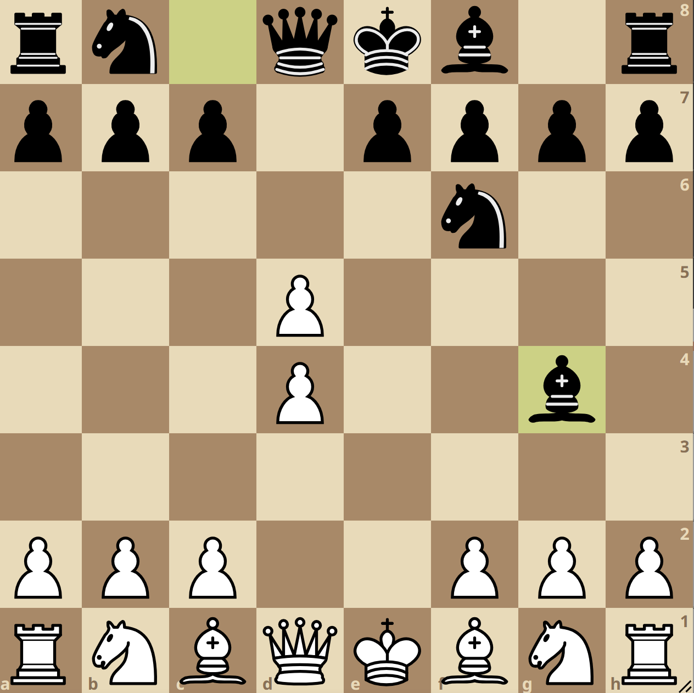
This is setting up for the Portuguese Gambit if I play the natural move 4. f3. The gambit is where black doesn't recapture the pawn on d5 in order to create an extremely sharp position. It is objectively worse for black, but there are a countless number of traps white can fall into despite playing seemingly natural moves.

What's funny is that Dan and I actually went over the Portuguese Gambit, he showed me a position where I could have easily lost if I went into that gambit. Knowing that, I played the move Nf3, giving back the pawn to my opponent to avoid the sharp lines.

4. Nf3 Qxd5 5. Be2 Nc6 6. Be3 O-O-O 7. O-O e5 8. c4 Qa5 9. Bd2 Bb4 10. d5 e4 11. Ng5 Bxe2 12. Qxe2 Nd4 13. Qd1 Bxd2 14. Qxd2 Qxd2 15. Nxd2 

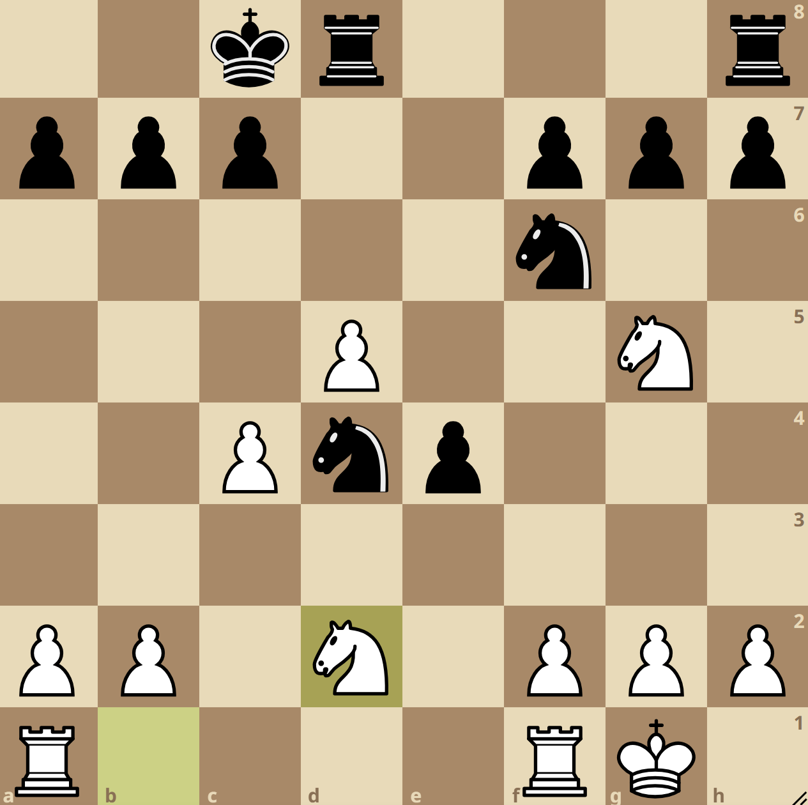

My g5 knight is attacking both the e4 and c7 pawns, and they both cannot be defended. My opponent defended the c7 pawn, allowing me to take the e4 pawn for free.

The computer says that he could have defended the e5 pawn with his h rook instead, the line goes 16. Nxf7 Rd7 17. Ng5 h6 18. Nh3 g5 - a rather disgusting line where you actually bait the knight into taking the seemingly free pawn just to force it into a miserable square where it's difficult for the knight to escape.

15. ... Rd7 16. Ngxe4 Nxe4 17. Nxe4 Re7 

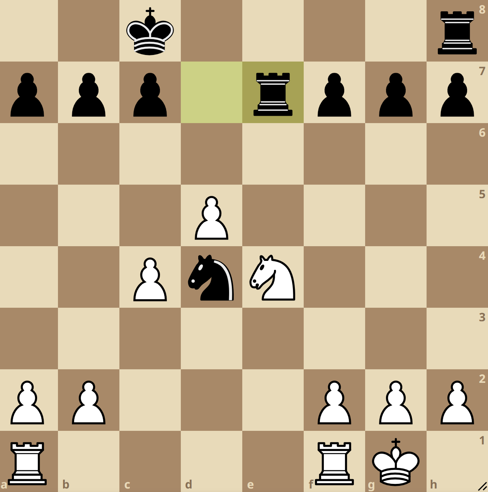

In this position, the engine said I was "+1.3", I should played the move f3, not only it defends my knight, but it also gives me the option to move my king to f2, a critical resource.

Instead I moved my knight back to g3, it became very obvious that I made a mistake as my opponent doubled up his rooks on the e file.

18. Ng3 Rhe8 19. b4 Ne2+ 20. Nxe2 Rxe2 

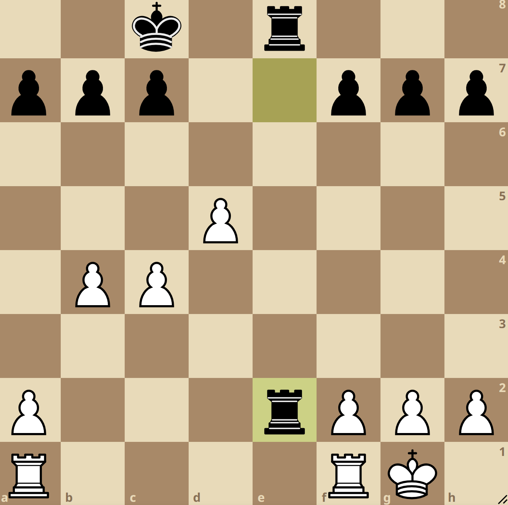

After the knight trade on e2, the rook on e2 is *extremely* well placed, there are ideas of moving the rook to c2 then bring the other rook down to the second rank as well. Even though I am up a pawn, this is extremely difficult to defend, and unfortunately I also lost this game both due to the nature of the position and the time pressure mounted onto me.

I wasn't feeling too great after that loss.

Round four results:

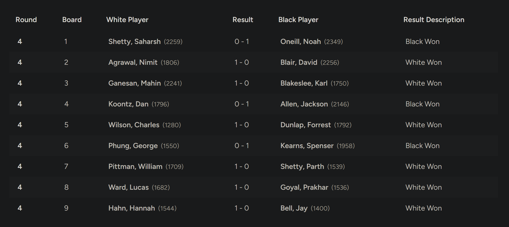

## Round 5

I felt better going into the final round, and my opponent was Parth Shetty (1539) with the black pieces. He was an extremely young opponent; there is actually a "meme" in the chess community where it's not the adults who are scary, it's the young children because they have an unbelievable amount of talent.

1. d4 Nf6 2. c4 e6 3. Nf3 d5 4. g3 c5 5. cxd5 exd5 6. Bg2 Nc6 7. Bg5 h6 8. Bxf6 Qxf6 9. e3 Be6 10. O-O Be7 11. dxc5 

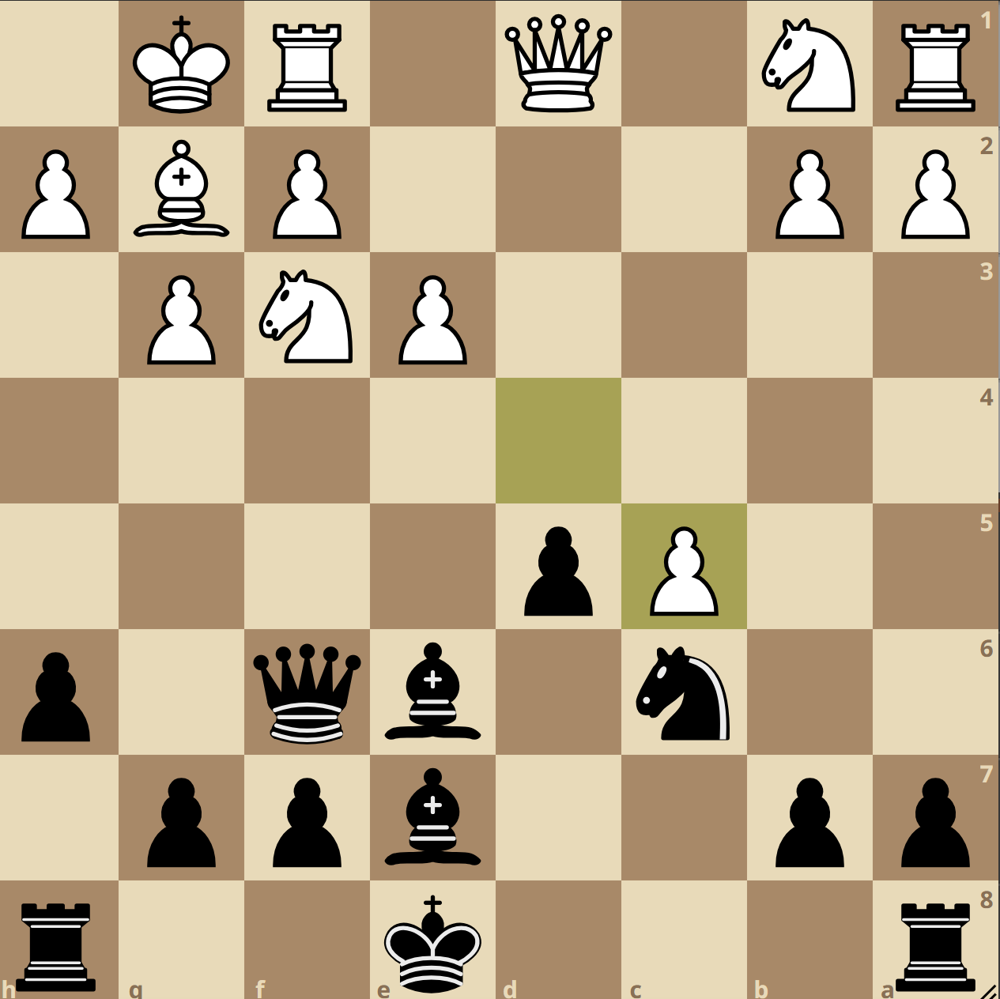

My opponent thought in the game that since I already moved my dark-squared bishop once, he's going to take my c5 pawn to essentially tell me that I wasted a move moving my bishop to e7.

What he had missed is that now the pawn on b2 is now undefended, and you bet I took the b2 pawn!

11. ... Qxb2 12. Nbd2 Bxc5 13. Nb3 Bb6 14. Qd3 Qf6 15. Rfd1 O-O 16. Nfd4 Rad8 17. Nxc6 bxc6 18. Rac1 Rc8 19. Nc5 Bf5 20. e4 dxe4 21. Nxe4 Bxf2+ 

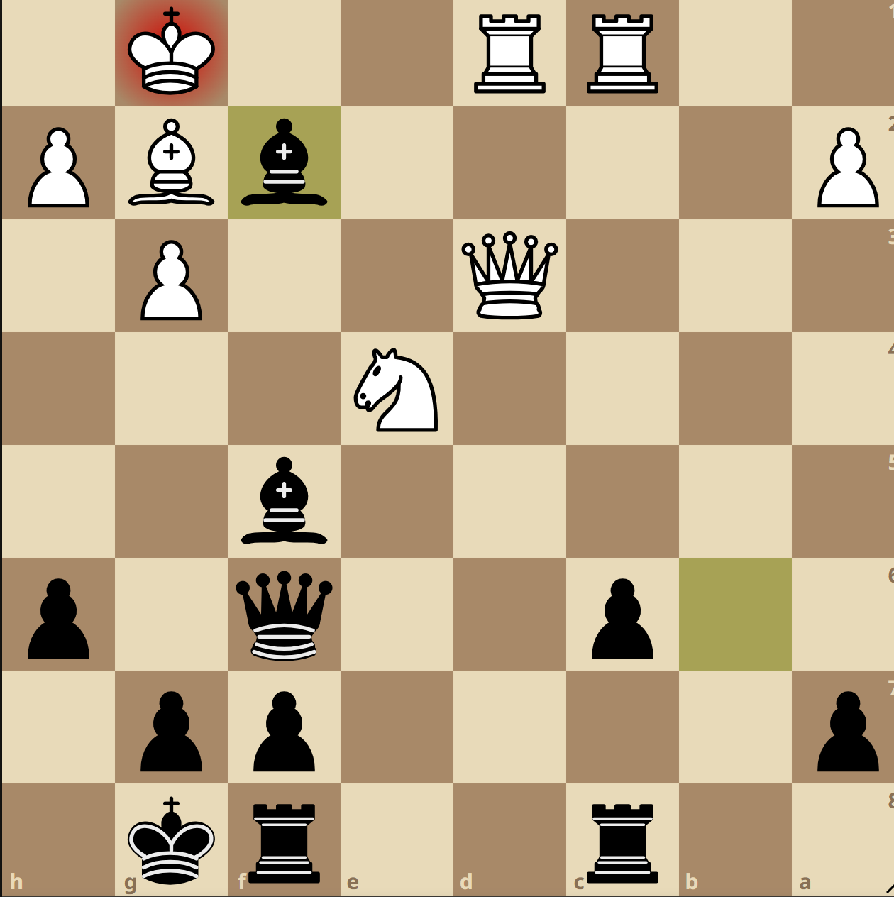

A nice move found by me, winning another pawn!

My opponent cannot take the bishop with the knight, as he would lose the queen. He also cannot take it with the king, as Bxe4+ is a knock-out blow.

22. Kh1 Bxe4 23. Qxe4 Rfe8 24. Qa4 Red8 25. Rf1 Qd4

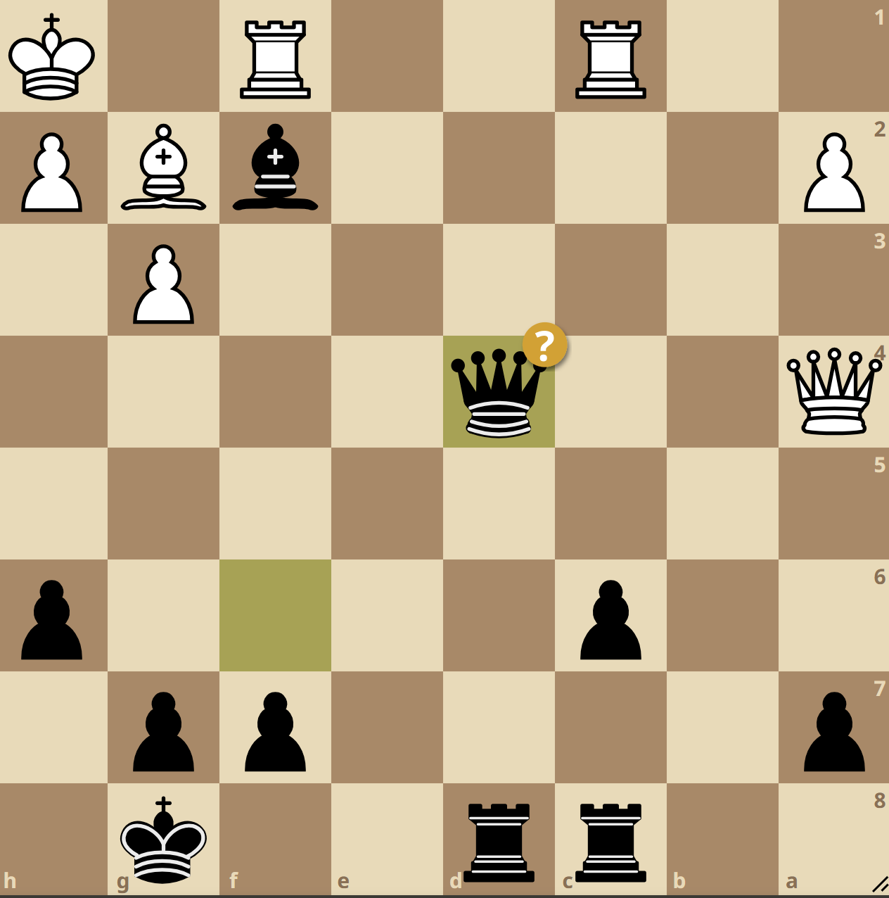

I had a pretty nice advantage until I played Qd4, that allowed my opponent to win back a pawn after a few exchanges.

It's important to know that we had opposite colored bishops, meaning that even if I'm up two whole pawns, the game could still be drawn.

I'm only up one pawn but his rook is staring at a weakness on f7.

26. Qxd4 Bxd4 27. Rxc6 Rxc6 28. Bxc6 Rd6 29. Be8 Rf6 30. Rxf6 Bxf6 31. a4 Kf8 32. Bb5 

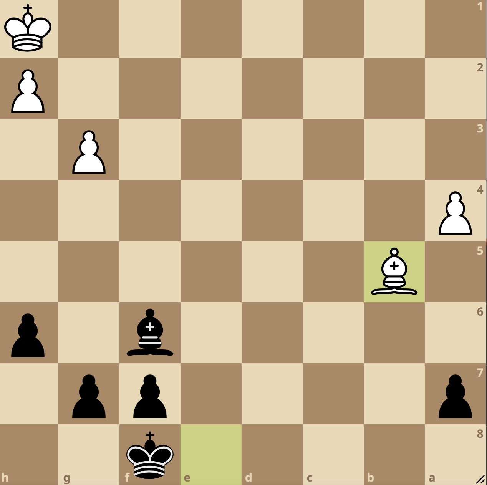

We traded our rooks, and this position is a dead draw despite me being up a pawn.

A rather boring result after I had a great advantage against my opponent, but kudos to him defending well!

Results of round 5:

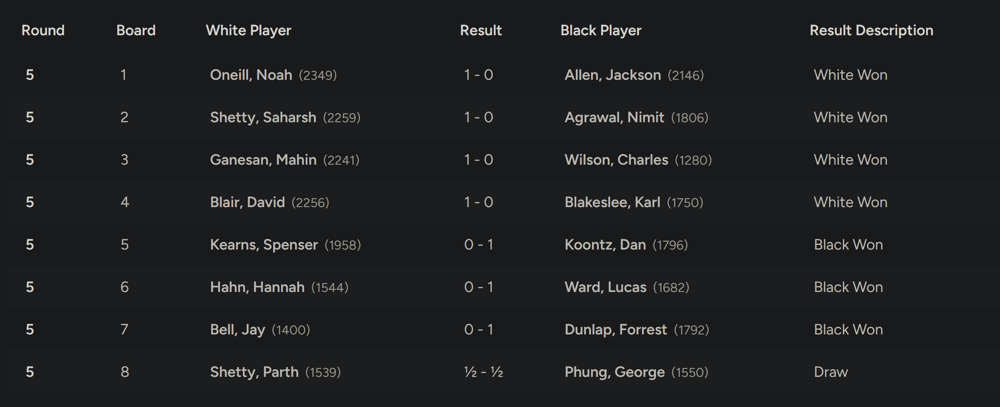

Final standings:

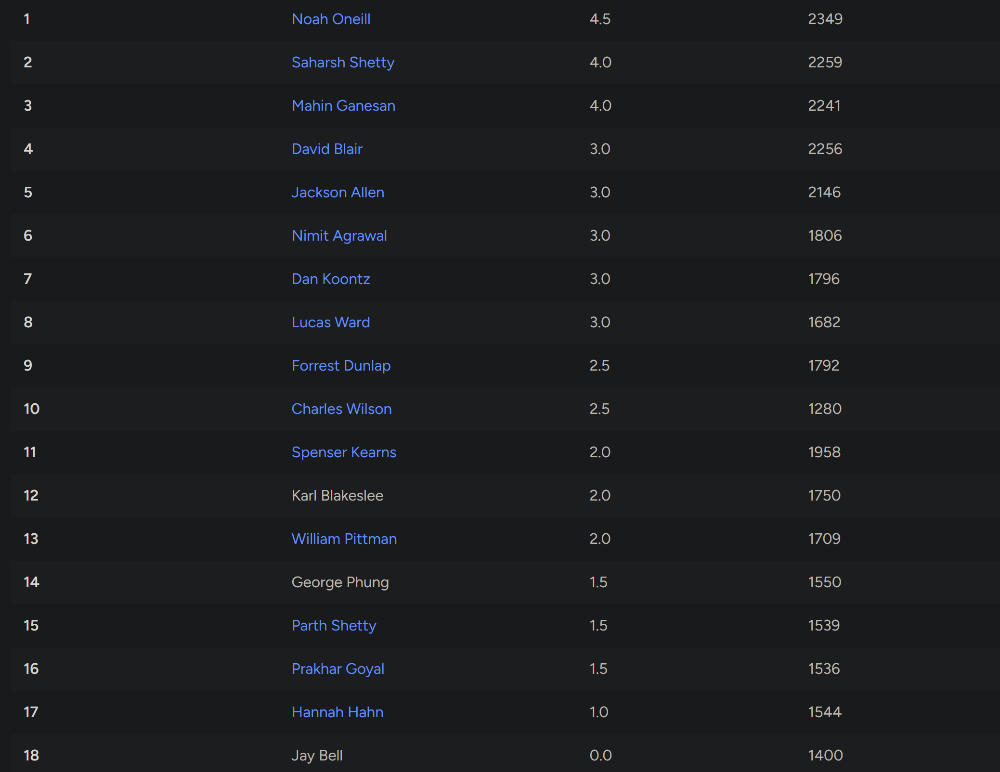

# Reflection

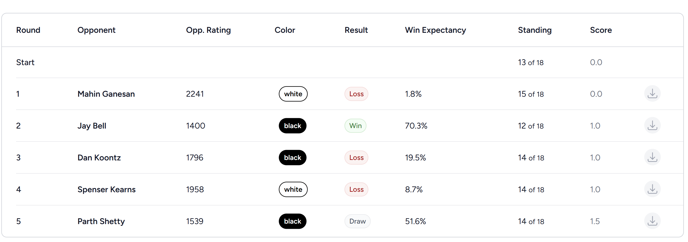

There will always be those types of thoughts of "what if I didnt blunder and could have won" as I had better positions in two of my games but I didn't win those two games. We often dwell on the mistakes we make rather than look at where we did well. Even though I lost most of my games, I played well in those games. Two of my opponents praised my skills, stating that I played much better than my rating (1550).

I am really grateful for this new experience provided by the RVA Pieces chess club! I got to play against   which certainly helped with my skills, and I will be be coming back to play another tournament!

What a way to spend Valentine's weekend without the Valentines.