# Introduction

# St. Inie's Coffee

Easily one of the best coffee shops you can find in Lexington Park. It's basically a coffee shop and a bookstore connected in one building, and the books were locally donated. There is also a children's room on the other side of the coffee shop as well!

I ordered an iced matcha latte because caffeine does nothing to me and I do not like the taste of coffee. They actually served my drinks in a little mason jar which I found to be pretty cute!

The enviroment of the bookstore was extremely cozy, it featured many coffee tables, a chess board, some couches, and several shelves filled with books on the perimeter.
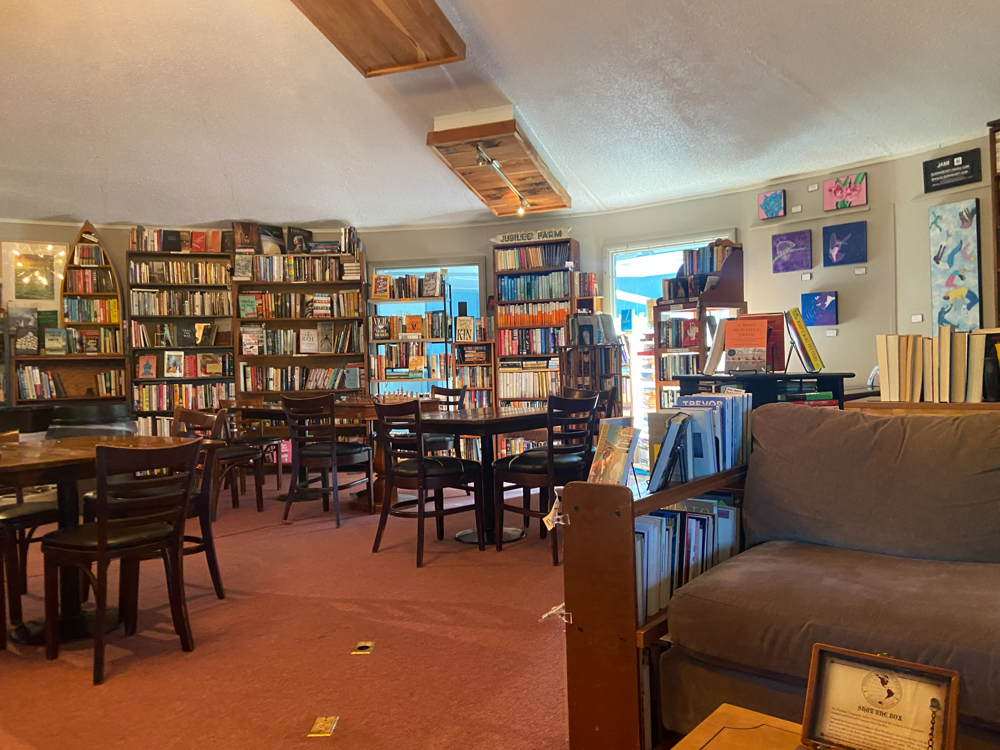

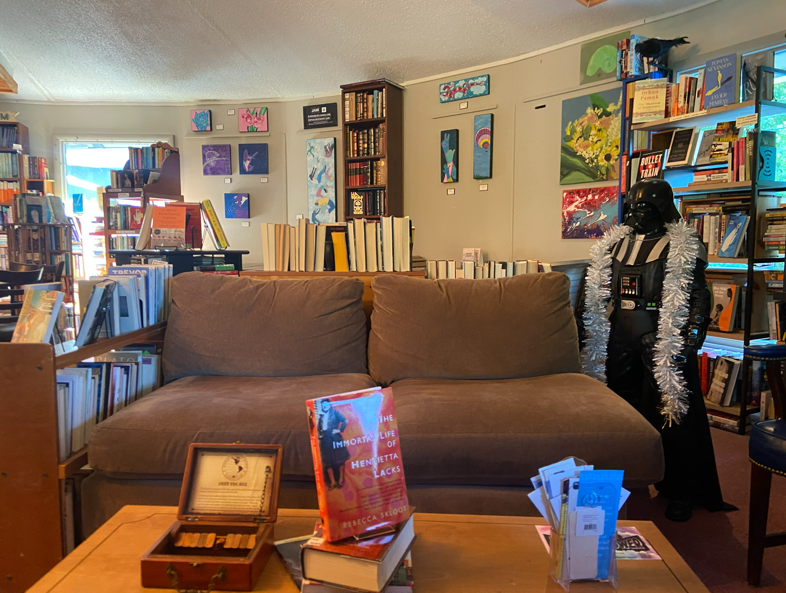

I was reading a book titled *Switch* by Chip Heath while at the bookstore. The book is about why humans are resistant to change and breaks it down. In the book, it discusses three components of a system:

The Rider, it's logical part of how you think.

The Elephant, it's the emotinal part of you.

The Path, it both controls how the Rider and the Elephant moves/

## TODO: ADD MORE DETAILS ABOUT THE BOOK

There was actually a nice little path right outside of the parking lot that leads into a park, named the John G. Lancaster Park.

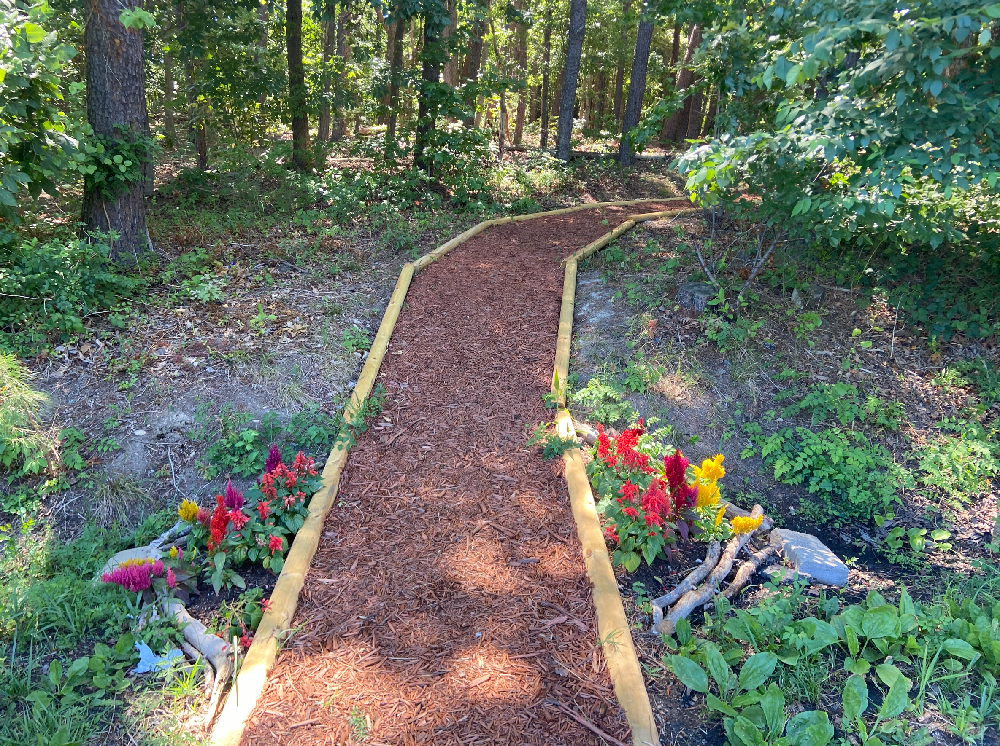

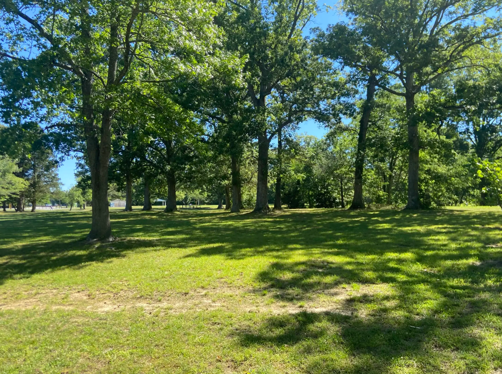

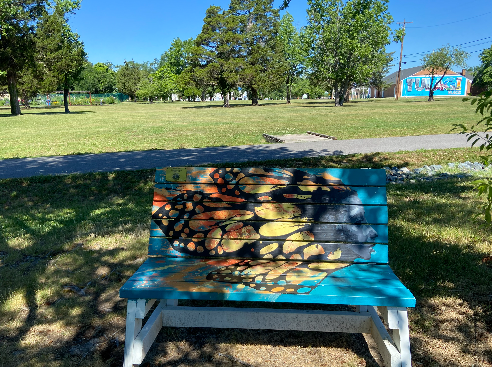

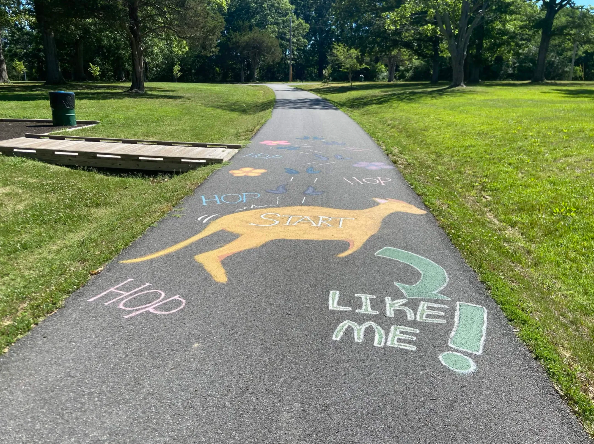

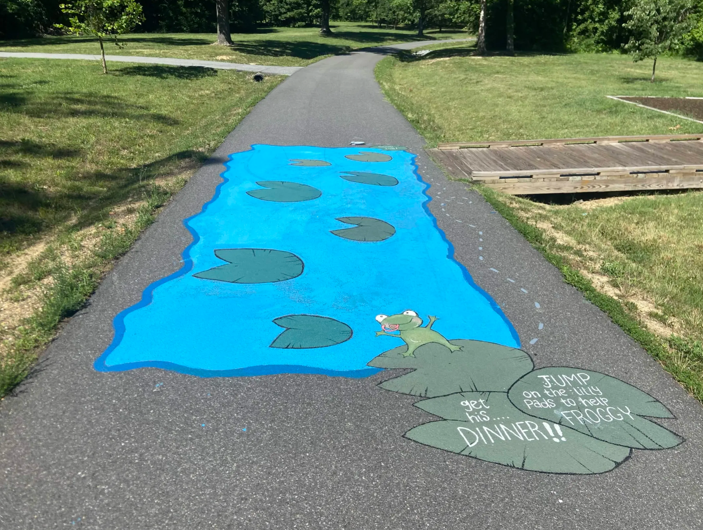

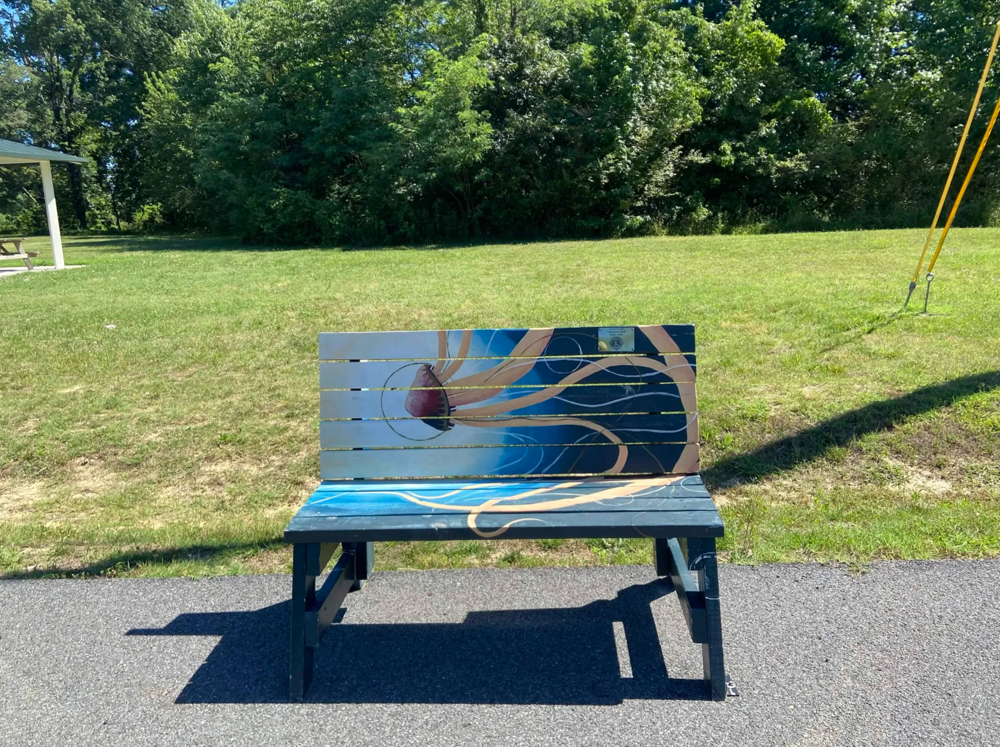

The walk there was really pleasant; I think the fact that there were the little drawings on the path made it much more calmer and safer.

# St. Mary's Lake

There's a nice lake in the St. Mary's River Park, I went there one weekend as I had an itch for hiking.

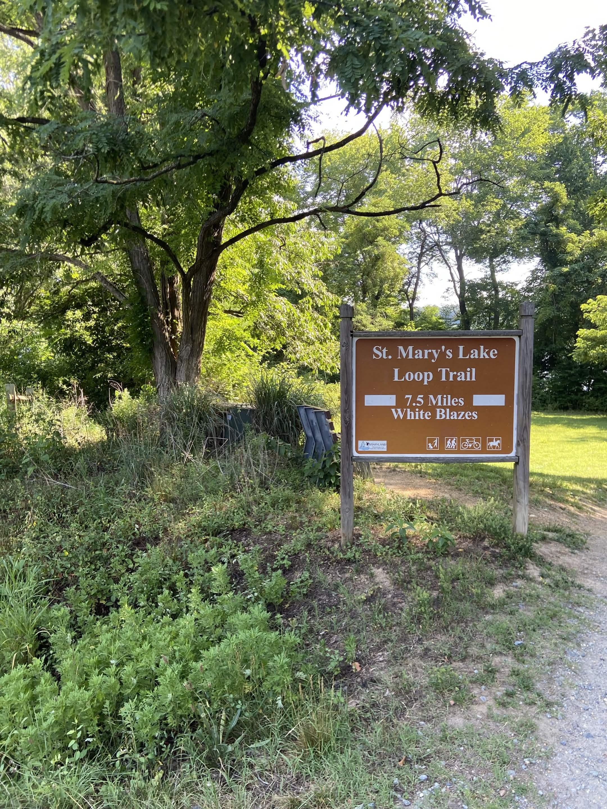

It featured a 7.5 mile hike, named the "White Blazes", which is basically one giant loop around the lake. Throughout my hike, there was many instances where the trail split into two different paths, I just so happen to always pick the left-most path and it just so happen to work out for me!

I was definitely underprepared for this hike; I only brought a baseball cap, a water bottle, my phone, and my battery pack (with no backpack). I also did not apply any bug spray or sunscreen, to which I come to regret later during the hike. The hike itself wasn't too strenuous, there were only a few climbs and drops, but had many great views!

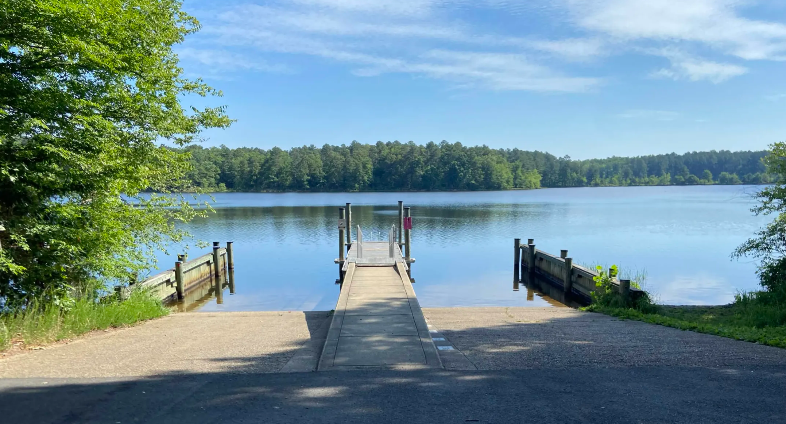
*The lake also featured a boat launching site, which I found to be pretty neat.*

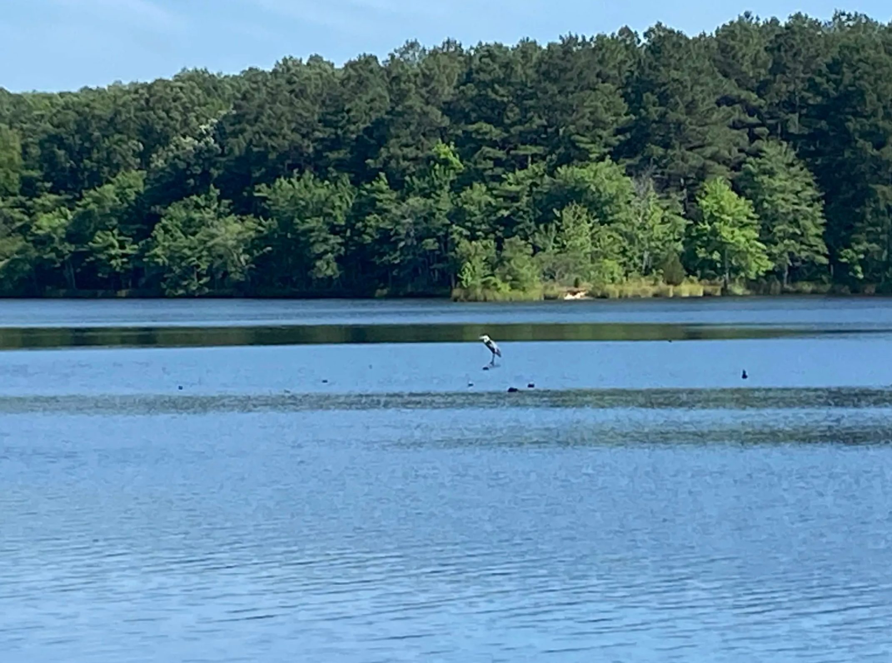
*Excuse the bad quality*

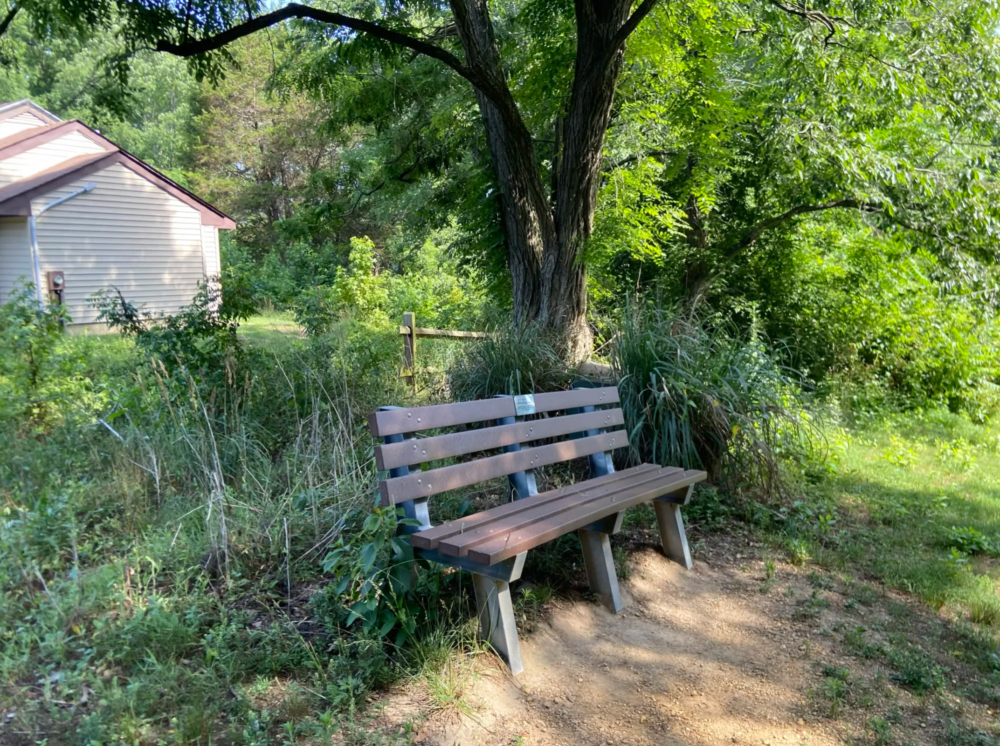

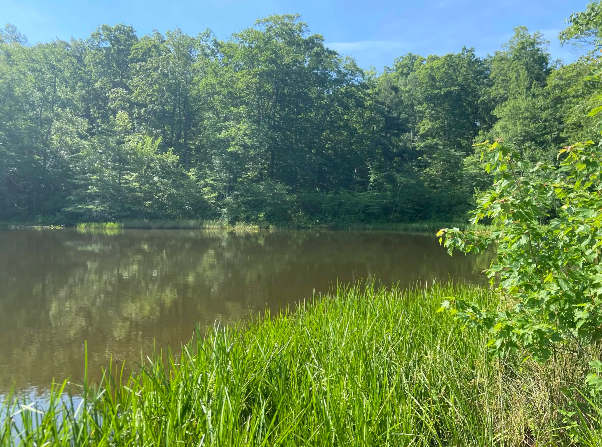

The wind softly nudged the trees, giving off the rustling sound of a thousand books gently turning, while the breeze brushed lightly against my skin. Combined with the late morning sunlight peeking through the tall trees and the mating calls of the Mourning Doves, the hike felt very cozy and relaxing. It's quite interesting how the Mourning Doves' calls has a universal experience for invoking nostalgia. Around 15 years ago, my mother used to take my sister and I to Maymont Park, a famous park in Richmond. I vaguely remember my mother pushing my sister's stroller while I followed my mother around the park, full of curiosity with the enviroment. 

near end
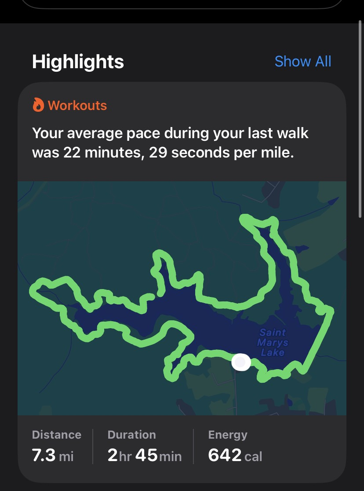

# Patuxent River Air Show